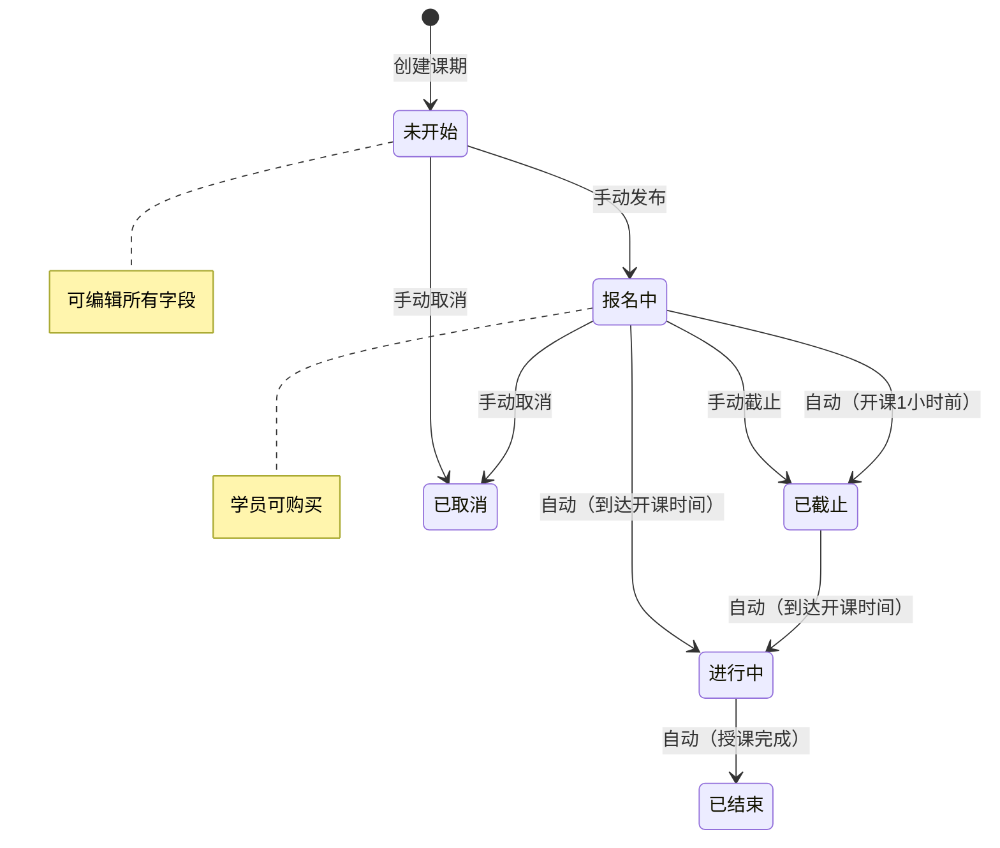
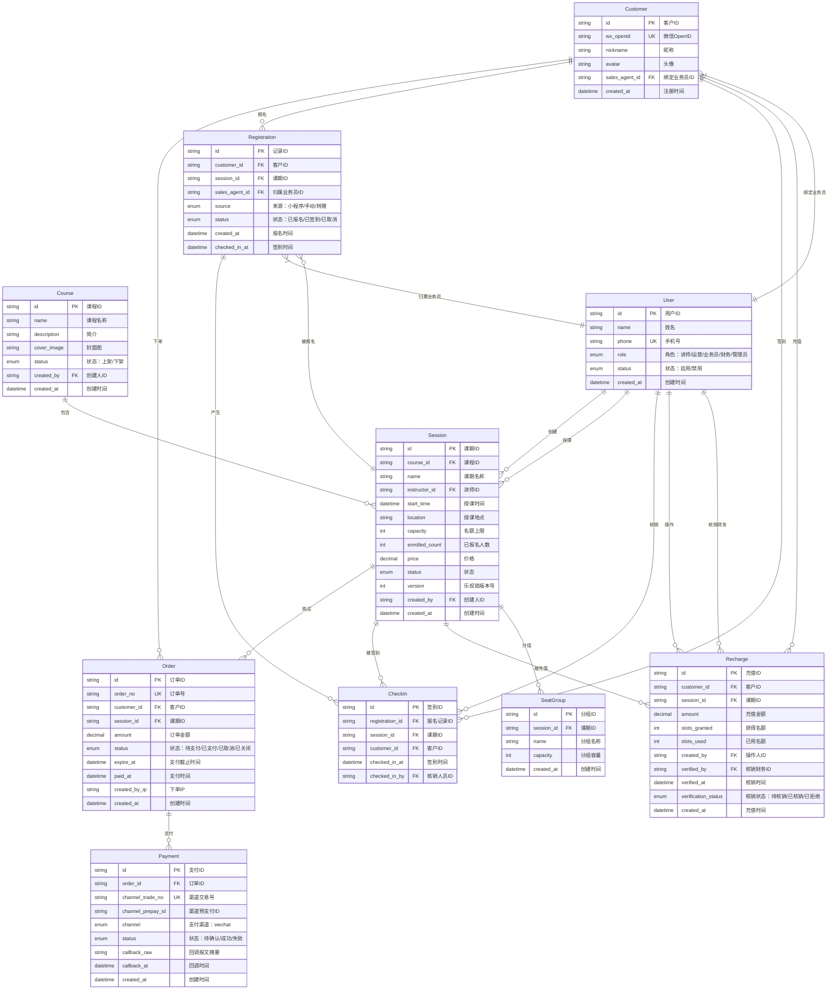
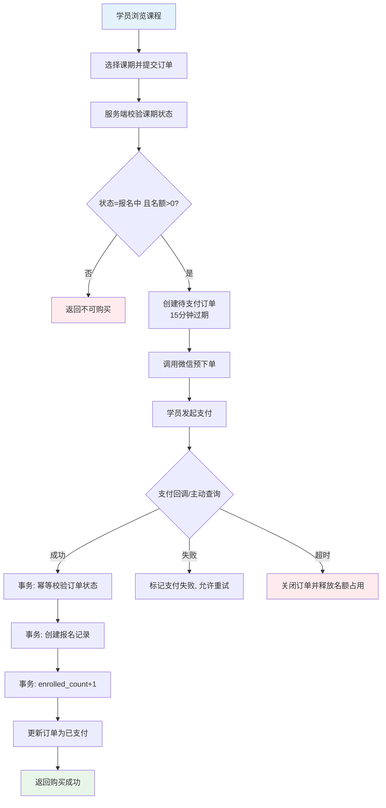
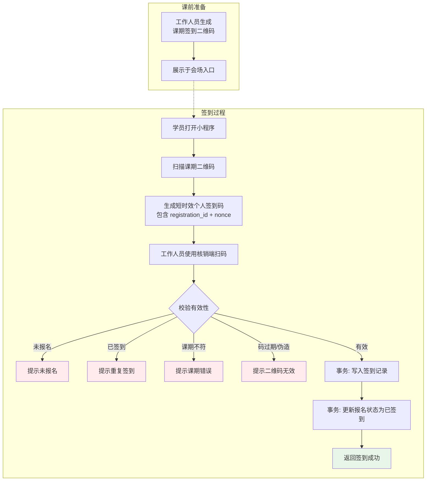
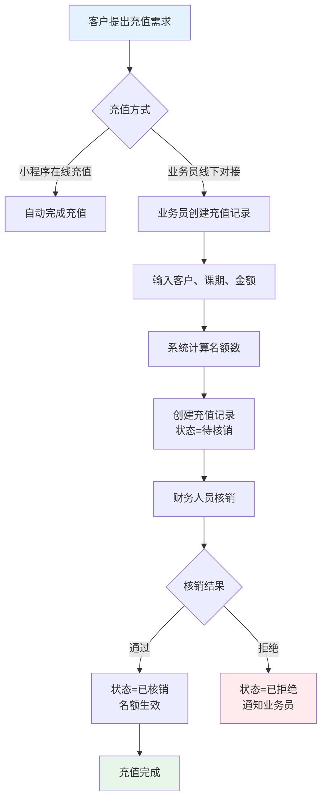
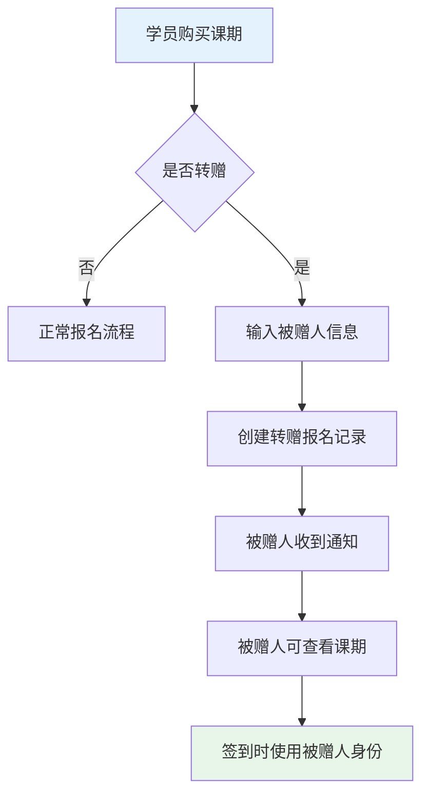

# 课程培训平台 - 产品需求文档 (PRD)

**版本**: v1.1

**日期**: 2026-04-21

**状态**: 修订稿

------

## 1. 产品概述

### 1.1 产品定位

面向职业技能培训的 B2C 课程平台，支持微信小程序端用户购课、签到，以及后台管理系统进行课程运营和学员管理。

### 1.2 目标用户

- **学员**：通过微信小程序购买课程、参与培训的 C 端用户
- **讲师**：授课并在后台查看课期学员的专业人士
- **运营人员**：负责课程上下架、课期安排的工作人员
- **业务员**：负责客户对接、课程销售的工作人员，业绩与学员报名绑定
- **财务人员**：负责核销充值记录的工作人员
- **管理员**：拥有系统全部权限，管理账号、权限和基础数据

### 1.3 核心价值

1. **便捷购课**：微信小程序内完成浏览、下单、支付全流程

2. **智能签到**：二维码双扫机制，防止代签，确保到场真实性

3. **灵活运营**：支持多课期管理、充值预购、座位分组等功能

4. **业绩追踪**：业务员与学员绑定，精准统计销售业绩

5. **灵活报名**：支持名额转赠，满足团购和代报名需求

   ------

   ## 2. 用户角色与权限

   | 角色         | 权限范围                                                     |
   | :----------- | :----------------------------------------------------------- |
   | **学员**     | 浏览课程、购买课期、扫码签到、查看已购课期                   |
   | **讲师**     | 查看自己授课的课期、查看课期学员列表、查看签到情况           |
   | **业务员**   | 客户管理（仅自己绑定的客户）、课程推荐、手动创建充值记录、查看个人业绩统计 |
   | **财务人员** | 充值记录核销、财务报表查看                                   |
   | **运营人员** | 课程管理（增删改查）、课期管理、客户管理、客户课期管理、会场座位管理 |
   | **管理员**   | 全部权限 + 账号管理（创建/禁用工作人员账号）、权限分配（可为非管理员用户设置角色如财务、业务员等）、数据导出 |
   
   ------

   ## 3. 功能模块

   ### 3.1 微信小程序（C 端）

   #### 3.1.1 用户注册

   - 微信用户首次进入小程序，自动完成注册
   - 注册信息：微信 OpenID、昵称、头像、注册时间
   
   #### 3.1.2 课程浏览

   - 课程列表：展示所有上架课程（名称、简介、封面、价格区间）
   - 课程详情：课程介绍、课期列表、价格、名额情况
   
   #### 3.1.3 课期购买

   - 选择课期 → 确认订单 → 微信支付 → 购买成功
   - 购买成功后，客户课期记录自动创建
   - **名额转赠功能**：购买时可选择"帮他人报名"，输入被赠人信息（姓名、手机号），系统创建转赠记录
   
   #### 3.1.4 我的课期

   - 展示已购买的课期列表（按时间倒序）
   - 课期状态：待上课、进行中、已完成
   - 签到入口：课期详情页展示专属签到二维码
   - **转赠管理**：可查看自己转赠给他人的课期，以及他人转赠给自己的课期
   
   #### 3.1.5 扫码签到

   **流程设计（双二维码防代签机制）：**

1. 工作人员在后台生成课期签到二维码
2. 学员使用小程序扫描课期二维码，生成个人专属签到二维码（含学员 ID、课期 ID、时间戳）
3. 工作人员使用核销端扫描学员个人二维码，完成签到

------

### 3.2 后台管理系统（B 端）

#### 3.2.1 客户管理

- **客户列表**：展示所有注册客户（微信昵称、头像、注册时间、购买次数）
- **客户详情**：基本信息、购买记录、签到记录、**绑定业务员**
- **手动添加**：运营人员可手动录入客户（用于线下转化场景）
- **业务员绑定**：每个客户可绑定一个业务员，用于业绩统计

#### 3.2.2 课程管理

**课程（Course）**

- 字段：课程 ID、课程名称、课程简介、封面图、创建人、创建时间、状态（上架/下架）
- 操作：新增、编辑、上架、下架、删除（无关联课期时）

**课期（Session）**

- 字段：课期 ID、所属课程、课期名称、讲师、授课时间、地点、名额、报名人数、课程价格、状态、创建人、创建时间
- 操作：新增、编辑、取消、删除（无报名记录时）

**课期状态流转：**

- **未开始**：课期创建后的初始状态，可编辑所有字段
- **报名中**：学员可购买，运营人员可手动设为「已截止」
- **已截止**：停止报名，自动或手动触发
- **进行中**：到达授课时间自动切换
- **已结束**：授课完成（自动）
- **已取消**：手动取消，已购学员需线下处理

#### 3.2.3 签到管理

- **签到二维码生成**：为每个课期生成唯一签到二维码
- **签到记录**：查看课期签到列表（学员、签到时间）
- **手动签到**：运营人员可为特殊情况手动标记签到

#### 3.2.4 会场座位

- **分组管理**：为课期创建座位分组（如 1组、2组、3组 或 A组、B组、C组）
- **学员分配**：将报名学员分配到指定分组
- **转赠学员分组**：转赠的学员可与其赠送人分配在同一分组，便于现场组织
- **用途**：现场组织、分组讨论、座位引导

#### 3.2.5 课程充值

- **充值记录**：记录客户对课期的预充值
- **名额计算**：充值金额 ÷ 课期单价 = 可用名额
- **使用场景**：企业团购、家长为孩子预存课时
- **业务员手动充值**：业务员可为线下对接的客户手动创建充值记录
- **财务核销**：手动创建的充值记录需要财务人员点击"核销"按钮确认，核销后名额才生效

#### 3.2.6 客户课期管理（培训报名）

- **报名记录**：客户与课期的关联记录
- **来源标记**：小程序购买 / 手动添加 / 转赠获得
- **状态**：已报名 / 已签到 / 已取消
- **业务员业绩**：每个报名记录关联对应的业务员，用于业绩统计

#### 3.2.7 账号管理（仅管理员）

- **工作人员列表**：讲师、运营人员、业务员、财务人员账号管理
- **角色分配**：创建账号时指定角色，管理员可随时调整非管理员用户的权限
- **状态控制**：启用 / 禁用账号

------

## 4. 数据模型

### 4.1 核心实体关系

### 4.2 字段定义

**Customer（客户）**

| 字段           | 类型     | 说明          |
| :------------- | :------- | :------------ |
| id             | string   | 客户 ID       |
| wx_openid      | string   | 微信 OpenID   |
| nickname       | string   | 微信昵称      |
| avatar         | string   | 头像 URL      |
| sales_agent_id | string   | 绑定业务员 ID |
| created_at     | datetime | 注册时间      |

**Course（课程）**

| 字段        | 类型     | 说明            |
| :---------- | :------- | :-------------- |
| id          | string   | 课程 ID         |
| name        | string   | 课程名称        |
| description | text     | 课程简介        |
| cover_image | string   | 封面图 URL      |
| status      | enum     | 状态：上架/下架 |
| created_by  | string   | 创建人 ID       |
| created_at  | datetime | 创建时间        |

**Order（订单）**

| 字段          | 类型     | 说明                              |
| :------------ | :------- | :-------------------------------- |
| id            | string   | 订单 ID                           |
| order_no      | string   | 业务订单号（唯一）                |
| customer_id   | string   | 客户 ID                           |
| session_id    | string   | 课期 ID                           |
| amount        | decimal  | 订单金额                          |
| status        | enum     | 状态：待支付/已支付/已取消/已关闭 |
| expire_at     | datetime | 支付截止时间                      |
| paid_at       | datetime | 实际支付时间                      |
| created_by_ip | string   | 下单来源 IP                       |
| created_at    | datetime | 创建时间                          |

**Payment（支付流水）**

| 字段              | 类型     | 说明                   |
| :---------------- | :------- | :--------------------- |
| id                | string   | 支付流水 ID            |
| order_id          | string   | 订单 ID                |
| channel_trade_no  | string   | 微信交易号（唯一）     |
| channel_prepay_id | string   | 微信预支付单号         |
| channel           | enum     | 渠道：wechat           |
| status            | enum     | 状态：待确认/成功/失败 |
| callback_raw      | text     | 支付回调关键报文摘要   |
| callback_at       | datetime | 回调时间               |
| created_at        | datetime | 创建时间               |

**Session（课期）**

| 字段           | 类型     | 说明                                            |
| :------------- | :------- | :---------------------------------------------- |
| id             | string   | 课期 ID                                         |
| course_id      | string   | 所属课程 ID                                     |
| name           | string   | 课期名称（如：第 1 期）                         |
| instructor_id  | string   | 讲师 ID                                         |
| start_time     | datetime | 授课时间                                        |
| location       | string   | 授课地点                                        |
| capacity       | int      | 名额上限                                        |
| enrolled_count | int      | 已报名人数                                      |
| price          | decimal  | 课程价格（元）                                  |
| status         | enum     | 状态：未开始/报名中/已截止/进行中/已结束/已取消 |
| version        | int      | 乐观锁版本号（并发扣减名额）                    |
| created_by     | string   | 创建人 ID                                       |
| created_at     | datetime | 创建时间                                        |

**Registration（客户课期/报名记录）**

| 字段           | 类型     | 说明                       |
| :------------- | :------- | :------------------------- |
| id             | string   | 记录 ID                    |
| customer_id    | string   | 客户 ID                    |
| session_id     | string   | 课期 ID                    |
| sales_agent_id | string   | 归属业务员 ID              |
| source         | enum     | 来源：小程序/手动/转赠     |
| status         | enum     | 状态：已报名/已签到/已取消 |
| created_at     | datetime | 报名时间                   |
| checked_in_at  | datetime | 签到时间                   |

**CheckIn（签到记录）**

| 字段            | 类型     | 说明        |
| :-------------- | :------- | :---------- |
| id              | string   | 签到 ID     |
| registration_id | string   | 报名记录 ID |
| session_id      | string   | 课期 ID     |
| customer_id     | string   | 客户 ID     |
| checked_in_at   | datetime | 签到时间    |
| checked_in_by   | string   | 核销人员 ID |

**Recharge（课程充值）**

| 字段                | 类型     | 说明                           |
| :------------------ | :------- | :----------------------------- |
| id                  | string   | 充值 ID                        |
| customer_id         | string   | 客户 ID                        |
| session_id          | string   | 课期 ID                        |
| amount              | decimal  | 充值金额                       |
| slots_granted       | int      | 获得名额数                     |
| slots_used          | int      | 已使用名额                     |
| created_by          | string   | 操作人 ID（业务员）            |
| verified_by         | string   | 核销财务 ID                    |
| verified_at         | datetime | 核销时间                       |
| verification_status | enum     | 核销状态：待核销/已核销/已拒绝 |
| created_at          | datetime | 充值时间                       |

**SeatGroup（会场座位分组）**

| 字段       | 类型     | 说明                               |
| :--------- | :------- | :--------------------------------- |
| id         | string   | 分组 ID                            |
| session_id | string   | 课期 ID                            |
| name       | string   | 分组名称（如：1组、2组、A组、B组） |
| capacity   | int      | 分组容量                           |
| created_at | datetime | 创建时间                           |

### 4.3 关键约束与索引建议

- 唯一约束：`Registration(customer_id, session_id)`，防止同一学员重复报名同一课期。
- 唯一约束：`CheckIn(registration_id)`，保证每个报名记录仅签到一次。
- 唯一约束：`Order(order_no)`、`Payment(channel_trade_no)`，保障交易幂等。
- 索引：`Session(status, start_time)`，用于课期列表和状态任务扫描。
- 索引：`Registration(session_id, status)`，用于签到页快速加载报名名单。
- 索引：`Order(customer_id, created_at)`，用于用户订单查询和对账。
- 索引：`Registration(sales_agent_id, created_at)`，用于业务员业绩统计。
- 数据一致性：`Session.enrolled_count` 与 `Registration` 变更放在同一事务中提交。

------

## 5. 关键业务流程

### 5.1 购课流程

**异常处理：**

- 并发超卖：下单和支付成功后写报名记录均需做名额二次校验（事务内）。
- 重复回调：按 `order_no` 和 `channel_trade_no` 幂等处理，重复通知直接返回成功。
- 支付超时：超过 `expire_at` 自动关闭订单，避免脏订单长期占用资源。

### 5.2 签到流程

**校验规则：**

- 学员必须已报名该课期
- 每个学员每课期只能签到一次
- 个人签到码建议 60~120 秒有效，核销后立即失效，防截图转发
- 不限制签到时间（课前课后均可，由现场灵活控制）

### 5.3 充值流程

### 5.4 名额转赠流程

## 6. 接口规范（关键接口）

### 6.1 小程序端

| 接口                  | 方法 | 说明                         |
| :-------------------- | :--- | :--------------------------- |
| /api/courses          | GET  | 获取课程列表                 |
| /api/courses/:id      | GET  | 获取课程详情                 |
| /api/sessions/:id     | GET  | 获取课期详情                 |
| /api/orders           | POST | 创建订单                     |
| /api/payments         | POST | 发起微信支付                 |
| /api/registrations    | GET  | 获取我的课期                 |
| /api/checkin/qrcode   | GET  | 获取课期签到二维码（扫码用） |
| /api/checkin/generate | POST | 生成个人签到码               |
| /api/gifts            | POST | 创建转赠记录                 |

### 6.2 管理后台

| 接口                            | 方法 | 说明               |
| :------------------------------ | :--- | :----------------- |
| /api/admin/courses              | CRUD | 课程管理           |
| /api/admin/sessions             | CRUD | 课期管理           |
| /api/admin/customers            | CRUD | 客户管理           |
| /api/admin/registrations        | CRUD | 客户课期管理       |
| /api/admin/checkin/qrcode       | GET  | 生成课期签到二维码 |
| /api/admin/checkin/verify       | POST | 扫码核销           |
| /api/admin/recharges            | POST | 课程充值（业务员） |
| /api/admin/recharges/:id/verify | POST | 充值核销（财务）   |
| /api/admin/seat-groups          | CRUD | 会场座位分组       |
| /api/admin/users/permissions    | PUT  | 权限分配（管理员） |

------

## 7. 非功能需求

### 7.1 性能要求

- 课程列表加载 < 1s
- 支付流程完成 < 3s
- 签到核销响应 < 500ms

### 7.2 安全要求

- 微信支付签名验证
- 管理后台接口 JWT 认证
- 敏感操作（充值、取消课期）需二次确认
- 财务核销操作需独立权限控制

### 7.3 兼容性

- 微信小程序：基础库 2.19.0+
- 管理后台：Chrome 90+, Safari 14+

------

## 8. 附录

### 8.1 术语表

| 术语   | 说明                                              |
| :----- | :------------------------------------------------ |
| 课程   | 抽象的课程类型，如「Python 入门」                 |
| 课期   | 课程的具体实例，如「Python 入门 -2026 年 4 月班」 |
| 客户   | 在小程序注册的用户                                |
| 报名   | 客户购买课期后产生的关联记录                      |
| 充值   | 预付费购买多个名额的方式                          |
| 业务员 | 负责客户销售的工作人员，与客户和报名记录绑定      |
| 转赠   | 将购买的课期名额转让给其他人的功能                |

------

**文档变更记录**

| 版本 | 日期       | 变更内容                                                     | 作者 |
| :--- | :--------- | :----------------------------------------------------------- | :--- |
| v1.0 | 2026-04-20 | 初稿完成                                                     | -    |
| v1.1 | 2026-04-21 | 1. 增加管理员权限分配功能2. 增加业务员绑定和业绩统计3. 优化会场座位分组和名额转赠功能4. 增加充值财务核销流程 | -    |