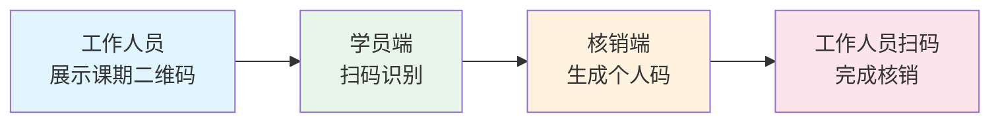
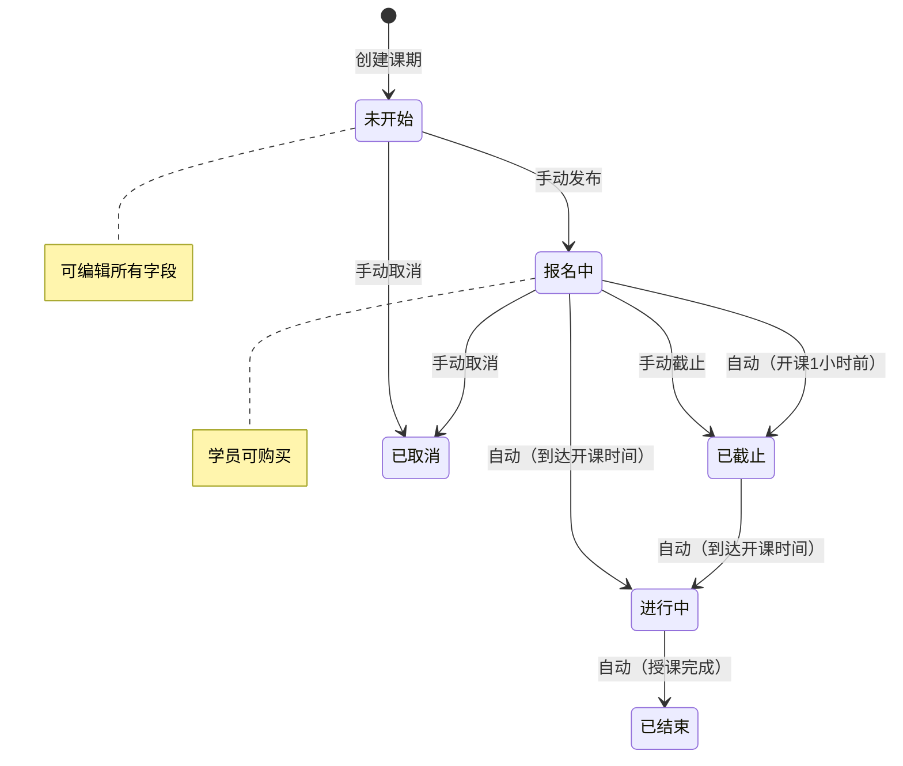
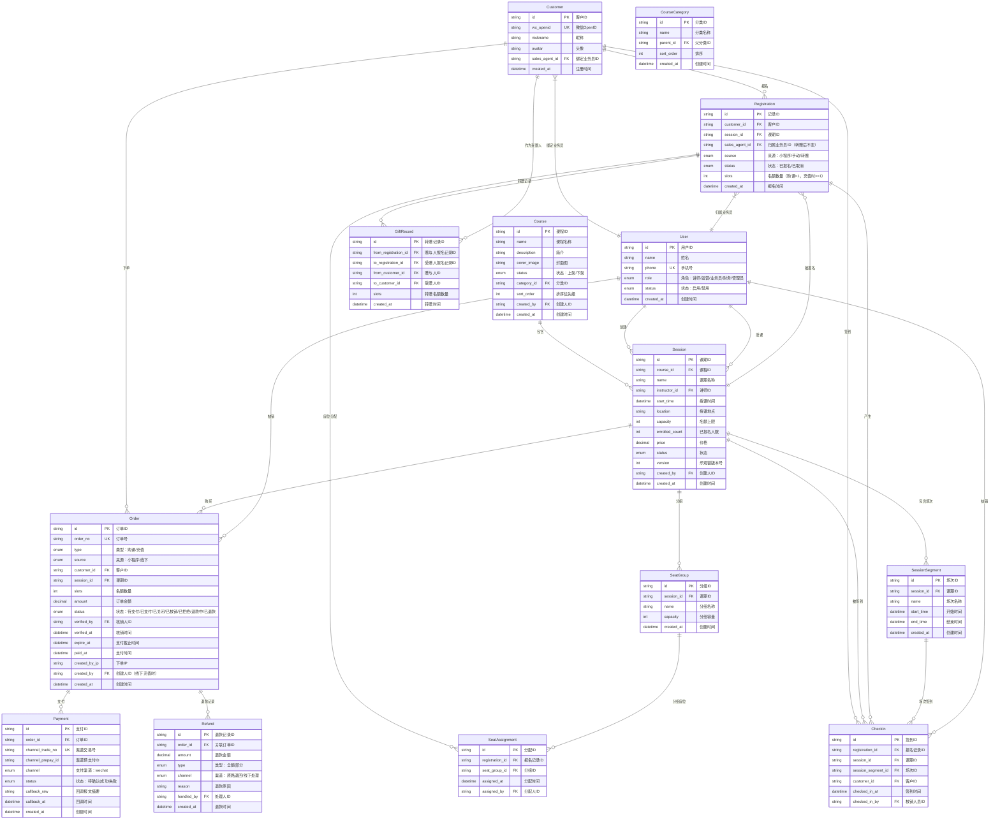
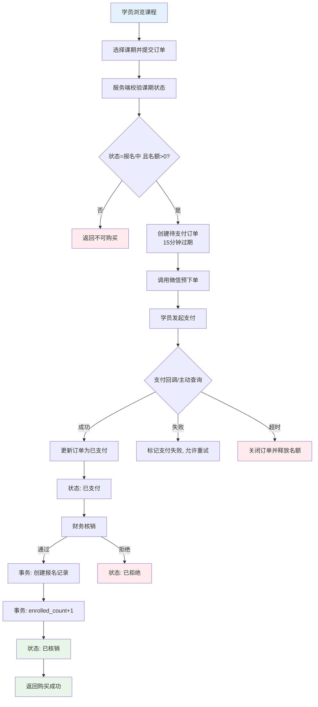
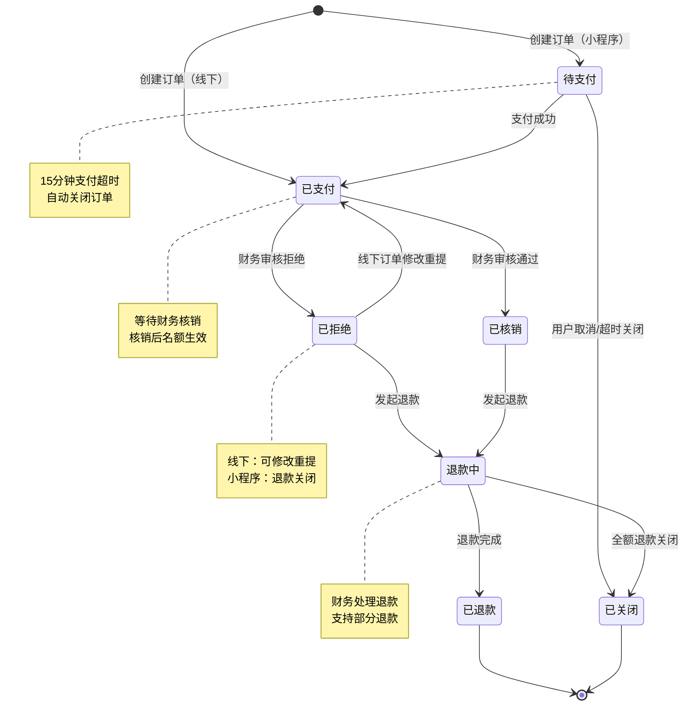
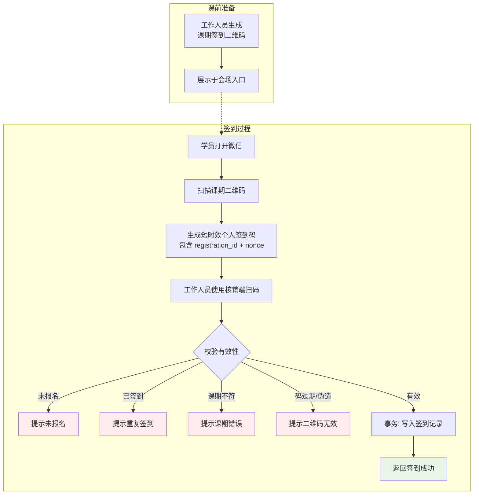
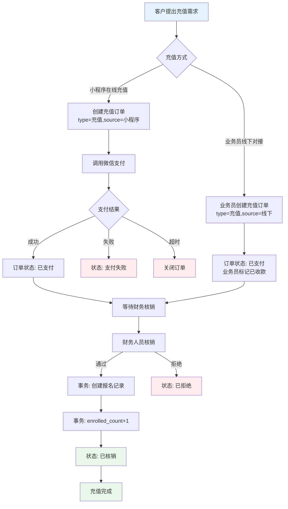
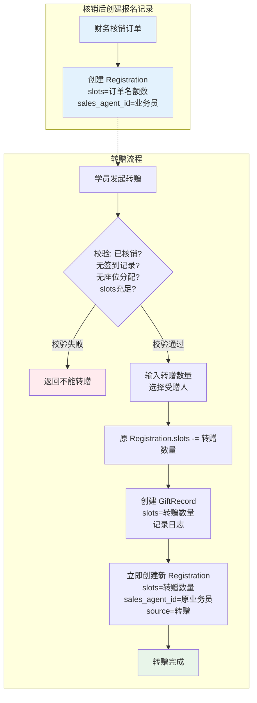
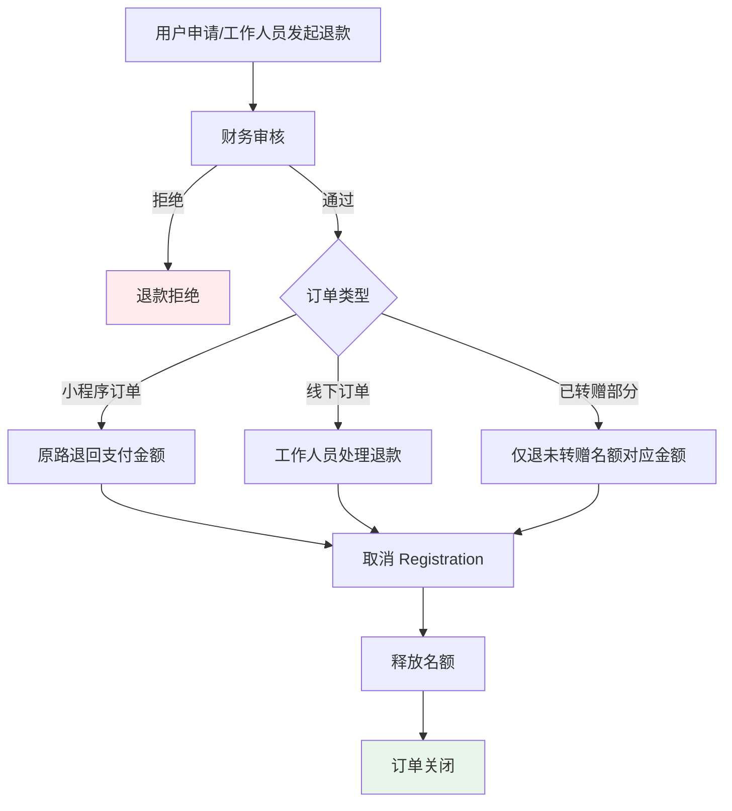

# 课程培训平台 - 产品需求文档 (PRD)

**版本**: v1.4

**日期**: 2026-04-22

**状态**: 修订稿

------

## 1. 产品概述

### 1.1 产品定位

面向职业技能培训的 B2C 课程平台，支持微信小程序端用户购课、签到，以及后台管理系统进行课程运营和学员管理。

### 1.2 目标用户

- **学员**：通过微信小程序购买课程、参与培训的 C 端用户
- **讲师**：授课并在后台查看课期学员的专业人士
- **业务员/运营人员**：负责课程上下架、课期安排、客户对接、课程销售的工作人员，业绩与学员报名绑定（同一角色，业务员仅管理自己绑定的客户数据）
- **财务人员**：负责核销充值记录的工作人员
- **管理员**：拥有系统全部权限，管理账号、分配权限

   ------

## 2. 用户角色与权限

   | 角色         | 权限范围                                                     |
   | :----------- | :----------------------------------------------------------- |
   | **学员**     | 浏览课程、购买课期、扫码签到、查看已购课期 、转赠                 |
   | **讲师**     | 查看自己授课的课期、查看课期学员列表、查看签到情况           |
   | **业务员**   | 客户管理（仅自己绑定的客户）、课程推荐、手动创建充值记录、查看个人业绩统计、课程/课期管理（仅查看）、客户课期管理（仅自己绑定的客户）、会场座位管理（仅自己绑定的客户）
   | **财务人员** | 充值记录核销、财务报表查看                                   |
   | **管理员**   | 全部权限 + 账号管理（创建/禁用工作人员账号）、权限分配（可为非管理员用户设置角色如财务、业务员等）、数据导出 |

   ------

## 3. 功能模块

### 3.1 微信小程序（C 端）

#### 3.1.1 用户注册

   - 微信用户首次进入小程序，自动完成注册
   - 注册信息：微信 OpenID、昵称、头像、注册时间
   
#### 3.1.2 课程浏览

   - 课程列表：展示所有上架课程（名称、简介、封面、价格区间）
   - 课程详情：课程介绍、课期列表、价格、名额情况
   
#### 3.1.3 课期购买

   - 选择课期 → 确认订单 → 微信支付 → 购买成功
   - 购买成功后，客户课期记录自动创建
   - **名额转赠功能（小程序）**：购买核销后可选择转赠，选择系统内客户作为受赠人，转赠立即生效，受赠人无需操作
   - 课期退款：需财务审核后手动处理，退款后释放名额
   
#### 3.1.4 我的课期

   - 展示已购买的课期列表（按时间倒序）
   - 课期状态：待上课、进行中、已完成
   - 签到入口：课期详情页展示专属签到二维码
   - **转赠管理**：可查看自己转赠给他人的课期记录，以及他人转赠给自己的课期记录
   
#### 3.1.5 扫码签到

   **流程设计（双二维码防代签机制）：**

1. 工作人员在后台生成课期签到二维码
2. 学员使用小程序扫描课期二维码，生成个人专属签到二维码（含学员 ID、课期 ID、时间戳）
3. 工作人员使用核销端扫描学员个人二维码，完成签到

------

### 3.2 后台管理系统（B 端）

#### 3.2.1 客户管理

- **客户列表**：展示所有注册客户（微信昵称、头像、注册时间、购买次数）
- **客户详情**：基本信息、购买记录、签到记录、**绑定业务员**
- **手动添加**：运营人员可手动录入客户（用于线下转化场景）
- **业务员绑定**：每个客户可绑定一个业务员，用于业绩统计

#### 3.2.2 课程管理

**课程（Course）**

- 字段：课程 ID、课程名称、课程简介、封面图、创建人、创建时间、状态（上架/下架）、归属类别、排序优先级
- 操作：新增、编辑、上架、下架、删除（无关联课期时）

**课期（Session）**

- 字段：课期 ID、所属课程、课期名称、讲师、授课时间、地点、名额、报名人数、课程价格、状态、创建人、创建时间
- 操作：新增、编辑、取消、删除（无报名记录时）

**课期状态流转：**

- **未开始**：课期创建后的初始状态，可编辑所有字段
- **报名中**：学员可购买，运营人员可手动设为「已截止」
- **已截止**：停止报名，自动或手动触发
- **进行中**：到达授课时间自动切换
- **已结束**：授课完成（自动）
- **已取消**：手动取消，已购学员需线下处理（财务核销）

#### 3.2.3 签到管理

- **签到二维码生成**：为每个课期生成唯一签到二维码
- **签到记录**：查看课期签到列表（学员、签到时间）
- **手动签到**：运营人员可为特殊情况手动标记签到

#### 3.2.4 会场座位

- **分组管理**：为课期创建座位分组（如 1 组、2 组、3 组 或 A 组、B 组、C 组）
- **学员分配**：工作人员手动将报名学员分配到指定分组
- **转赠学员分组**：转赠的学员可与其赠送人分配在同一分组，便于现场组织
- **用途**：现场组织、分组讨论、座位引导

#### 3.2.5 课程充值

- **充值**：客户对指定课期预存名额，支持小程序充值和业务员线下创建
- **名额计算**：充值金额 ÷ 课期单价 = 名额数量
- **使用场景**：企业团购、家长为孩子预存课时
- **统一订单模式**：购课和充值都走 Order 表，全部需财务核销
- **业务员线下充值**：业务员为客户手动创建充值订单，直接标记为已支付（现金/转账已收），等待财务核销
- **财务核销**：所有订单（购课/充值）支付成功后状态为已支付，财务人员核销后变为已核销，名额生效并创建报名记录
- **退款处理**：仅支持退剩余未转赠部分（如购买5个名额，转赠2个，只可退3个），已转赠部分不可退款

#### 3.2.6 客户课期管理（培训报名）

- **报名记录**：客户与课期的关联记录
- **来源标记**：小程序购买 / 手动添加 / 转赠获得
- **状态**：已报名 / 已取消（签到状态以 CheckIn 记录为准）
- **业务员业绩**：每个报名记录关联对应的业务员，用于业绩统计
- SessionSegment 创建：课期创建时默认生成一个「全场次」，工作人员可再添加其他场次（如上午场、下午场）

#### 3.2.7 账号管理（仅管理员）

- **工作人员列表**：讲师、业务员、财务人员账号管理
- **角色分配**：创建账号时指定角色，管理员可随时调整非管理员用户的权限
- **状态控制**：启用 / 禁用账号

------

## 4. 数据模型

### 4.1 核心实体关系

### 4.2 字段定义

**Customer（客户）**

| 字段           | 类型     | 说明          |
| :------------- | :------- | :------------ |
| id             | string   | 客户 ID       |
| wx_openid      | string   | 微信 OpenID   |
| nickname       | string   | 微信昵称      |
| avatar         | string   | 头像 URL      |
| sales_agent_id | string   | 绑定业务员 ID |
| created_at     | datetime | 注册时间      |

**Course（课程）**

| 字段        | 类型     | 说明            |
| :---------- | :------- | :-------------- |
| id          | string   | 课程 ID         |
| name        | string   | 课程名称        |
| description | text     | 课程简介        |
| cover_image | string   | 封面图 URL      |
| status      | enum     | 状态：上架/下架 |
| category_id | string   | 分类 ID         |
| sort_order  | int      | 排序优先级      |
| created_by  | string   | 创建人 ID       |
| created_at  | datetime | 创建时间        |

**CourseCategory（课程分类）**

| 字段       | 类型     | 说明                  |
| :--------- | :------- | :-------------------- |
| id         | string   | 分类 ID               |
| name       | string   | 分类名称              |
| parent_id  | string   | 父分类 ID（支持层级） |
| sort_order | int      | 排序序号              |
| created_at | datetime | 创建时间              |

**Order（订单）**

| 字段                | 类型     | 说明                              |
| :------------------ | :------- | :-------------------------------- |
| id                  | string   | 订单 ID                           |
| order_no            | string   | 业务订单号（唯一）                |
| type                | enum     | 类型：购课/充值                   |
| source              | enum     | 来源：小程序/线下                 |
| customer_id         | string   | 客户 ID                           |
| session_id          | string   | 课期 ID                           |
| slots               | int      | 名额数量（充值时 > 1）            |
| amount              | decimal  | 订单金额                          |
| status              | enum     | 状态：待支付/已支付/已关闭/已核销/已拒绝/退款中/已退款 |
| verified_by         | string   | 核销人 ID（已核销/已拒绝时填充）  |
| verified_at         | datetime | 核销时间                          |
| expire_at           | datetime | 支付截止时间                      |
| paid_at             | datetime | 实际支付时间                      |
| created_by_ip       | string   | 下单来源 IP                       |
| created_by          | string   | 创建人 ID（线下充值时）           |
| created_at          | datetime | 创建时间                          |

**Payment（支付流水）**

| 字段              | 类型     | 说明                   |
| :---------------- | :------- | :--------------------- |
| id                | string   | 支付流水 ID            |
| order_id          | string   | 订单 ID                |
| channel_trade_no  | string   | 微信交易号（唯一）     |
| channel_prepay_id | string   | 微信预支付单号         |
| channel           | enum     | 渠道：wechat           |
| status            | enum     | 状态：待确认/成功/失败 |
| callback_raw      | text     | 支付回调关键报文摘要   |
| callback_at       | datetime | 回调时间               |
| created_at        | datetime | 创建时间               |

**Session（课期）**

| 字段             | 类型       | 说明                         |
| :------------- | :------- | :------------------------- |
| id             | string   | 课期 ID                      |
| course_id      | string   | 所属课程 ID                    |
| name           | string   | 课期名称（如：第 1 期）              |
| instructor_id  | string   | 讲师 ID                      |
| start_time     | datetime | 授课时间                       |
| location       | string   | 授课地点                       |
| capacity       | int      | 名额上限                       |
| enrolled_count | int      | 已报名人数                      |
| price          | decimal  | 课程价格（元）                    |
| status         | enum     | 状态：未开始/报名中/已截止/进行中/已结束/已取消 |
| version        | int      | 乐观锁版本号（并发扣减名额）             |
| created_by     | string   | 创建人 ID                     |
| created_at     | datetime | 创建时间                       |

**Registration（客户课期/报名记录）**

| 字段           | 类型     | 说明                                    |
| :------------- | :------- | :-------------------------------------- |
| id             | string   | 记录 ID                                 |
| customer_id    | string   | 客户 ID                                 |
| session_id     | string   | 课期 ID                                 |
| sales_agent_id | string   | 归属业务员 ID（转赠后业绩归属不变）     |
| source         | enum     | 来源：小程序/手动/转赠                  |
| status         | enum     | 状态：已报名/已取消                     |
| slots          | int      | 名额数量（购课=1，充值时>=1）           |
| created_at     | datetime | 报名时间                                |

**CheckIn（签到记录）**

| 字段                | 类型     | 说明                    |
| :------------------ | :------- | :---------------------- |
| id                  | string   | 签到 ID                 |
| registration_id     | string   | 报名记录 ID             |
| session_id          | string   | 课期 ID                 |
| session_segment_id  | string   | 场次 ID（多场签到支持） |
| customer_id         | string   | 客户 ID                 |
| checked_in_at       | datetime | 签到时间                |
| checked_in_by       | string   | 核销人员 ID             |

**SeatAssignment（座位分配）**

| 字段            | 类型     | 说明        |
| :-------------- | :------- | :---------- |
| id              | string   | 分配 ID     |
| registration_id | string   | 报名记录 ID |
| seat_group_id   | string   | 分组 ID     |
| assigned_at     | datetime | 分配时间    |
| assigned_by     | string   | 分配人 ID   |

**SessionSegment（课期场次）**

| 字段       | 类型     | 说明     |
| :--------- | :------- | :------- |
| id         | string   | 场次 ID  |
| session_id | string   | 课期 ID  |
| name       | string   | 场次名称 |
| start_time | datetime | 开始时间 |
| end_time   | datetime | 结束时间 |
| created_at | datetime | 创建时间 |

**GiftRecord（转赠记录）**

| 字段                | 类型     | 说明                    |
| :------------------ | :------- | :---------------------- |
| id                  | string   | 转赠记录 ID             |
| from_registration_id | string  | 赠与人报名记录 ID       |
| to_registration_id  | string   | 受赠人报名记录 ID       |
| from_customer_id    | string   | 赠与人 ID               |
| to_customer_id      | string   | 受赠人 ID               |
| slots               | int      | 转赠名额数量            |
| created_at          | datetime | 转赠时间                |

**Refund（退款记录）**

| 字段                | 类型     | 说明                    |
| :------------------ | :------- | :---------------------- |
| id                  | string   | 退款记录 ID             |
| order_id            | string   | 关联订单 ID             |
| amount              | decimal  | 退款金额                |
| type                | enum     | 类型：全额/部分         |
| channel             | enum     | 渠道：原路退回/线下处理 |
| reason              | string   | 退款原因                |
| handled_by          | string   | 处理人 ID               |
| created_at          | datetime | 退款时间                |

**SeatGroup（会场座位分组）**

| 字段       | 类型     | 说明                               |
| :--------- | :------- | :--------------------------------- |
| id         | string   | 分组 ID                            |
| session_id | string   | 课期 ID                            |
| name       | string   | 分组名称（如：1 组、2 组、A 组、B 组） |
| capacity   | int      | 分组容量                           |
| created_at | datetime | 创建时间                           |

### 4.3 关键约束与索引建议

- 唯一约束：`Registration(customer_id, session_id, source)`，source=转赠时允许重复（同一学员可接收多次转赠）
- 唯一约束：`CheckIn(registration_id, session_segment_id)`，防止同一学员同一场次重复签到
- 签到状态以 `CheckIn` 记录为准，`Registration` 不再维护签到状态
- 唯一约束：`Order(order_no)`、`Payment(channel_trade_no)`，保障交易幂等。
- 索引：`Session(status, start_time)`，用于课期列表和状态任务扫描。
- 索引：`Registration(session_id, status)`，用于签到页快速加载报名名单。
- 索引：`Order(customer_id, created_at)`，用于用户订单查询和对账。
- 索引：`Registration(sales_agent_id, created_at)`，用于业务员业绩统计。
- 数据一致性：`Session.enrolled_count` 与 `Registration` 变更放在同一事务中提交。

------

## 5. 关键业务流程

### 5.1 购课流程

**异常处理：**

- 并发超卖：支付成功和财务核销时均需做名额二次校验（事务内）。
- 重复回调：按 `order_no` 和 `channel_trade_no` 幂等处理，重复通知直接返回成功。
- 支付超时：超过 `expire_at` 自动关闭订单，避免脏订单长期占用资源。
- 核销拒绝：财务拒绝后订单状态为"已拒绝"
  - 线下订单：业务员可修改信息后重新提交核销申请
  - 小程序订单：财务手动发起退款（原路退回），订单关闭

### 5.2 订单状态流转

**订单状态说明：**

| 状态 | 说明 |
| :--- | :--- |
| **待支付** | 订单创建，等待用户支付（仅小程序订单） |
| **已支付** | 支付成功，等待财务核销 |
| **已关闭** | 订单关闭（取消/超时/全额退款） |
| **已核销** | 财务审核通过，名额生效 |
| **已拒绝** | 财务审核拒绝，等待处理 |
| **退款中** | 退款申请处理中 |
| **已退款** | 部分退款完成，订单仍有效 |

**退款独立记录：**

| 字段 | 说明 |
| :--- | :--- |
| id | 退款记录ID |
| order_id | 关联订单ID |
| amount | 退款金额 |
| type | 类型：全额/部分 |
| channel | 渠道：原路退回/线下处理 |
| reason | 退款原因 |
| handled_by | 处理人ID |
| created_at | 退款时间 |

**退款规则：**
- 未核销订单：直接退款，订单关闭
- 已核销订单全额退款：取消Registration，订单关闭
- 已核销订单部分退款：保留Registration（slots减少），订单变为"已退款"
- 线下订单退款：财务手动处理，记录日志

### 5.3 签到流程

**校验规则：**

- 学员必须已报名该课期
- 每个学员每场次只能签到一次，同一课期不同场次可重复签到
- 个人签到码有效期可配置（默认 120 秒），核销后立即失效，防截图转发
- 不限制签到时间（课前课后均可，由现场灵活控制）

### 5.3 充值流程（统一订单模式）

### 5.4 名额转赠流程

**转赠规则：**
- 核销后才能转赠（Order.status = 已核销）
- 支持部分转赠、多次转赠（不限制次数）
- 已签到或已分配座位的名额不能转赠
- 业绩始终归属最开始的业务员（Registration.sales_agent_id 不变）
- 转赠立即生效，受赠人无需操作

**转赠链支持：**
- 允许无限次转赠（A→B→C→D...）
- 每次转赠都创建新的 GiftRecord 和 Registration
- 所有转赠产生的 Registration 业绩都归属最开始的业务员
- slots=0 的 Registration 保持「已报名」状态，不在小程序展示

### 5.5 退款流程

**退款规则：**
- 退款入口：小程序用户申请 或 后台工作人员发起
- 已核销订单可退款，退款后取消 Registration，释放名额
- 退款金额按原始订单金额计算
- 转赠后仅支持退剩余未转赠部分（如购买5个名额，转赠2个，只可退3个）
- 线下订单退款由工作人员处理，记录日志即可

**退款处理细节：**
- 已核销订单退款：取消 Registration，恢复 Session.enrolled_count
- 未核销订单退款：直接关闭订单，无需恢复名额
- 部分退款（转赠后）：按剩余 slots 数量计算退款金额
- 线下订单：财务手动处理，系统记录退款日志

## 6. 接口规范（关键接口）

### 6.1 小程序端

| 接口                  | 方法 | 说明                         |
| :-------------------- | :--- | :--------------------------- |
| /api/courses          | GET  | 获取课程列表                 |
| /api/courses/:id      | GET  | 获取课程详情                 |
| /api/sessions/:id     | GET  | 获取课期详情                 |
| /api/orders           | POST | 创建订单                     |
| /api/payments         | POST | 发起微信支付                 |
| /api/registrations    | GET  | 获取我的课期                 |
| /api/checkin/qrcode   | GET  | 获取课期签到二维码（扫码用） |
| /api/checkin/generate | POST | 生成个人签到码               |
| /api/gifts            | POST | 创建转赠记录                 |

### 6.2 管理后台

| 接口                            | 方法 | 说明               |
| :------------------------------ | :--- | :----------------- |
| /api/admin/courses              | CRUD | 课程管理           |
| /api/admin/sessions             | CRUD | 课期管理           |
| /api/admin/customers            | CRUD | 客户管理           |
| /api/admin/registrations        | CRUD | 客户课期管理       |
| /api/admin/checkin/qrcode       | GET  | 生成课期签到二维码 |
| /api/admin/checkin/verify       | POST | 扫码核销           |
| /api/admin/orders               | POST | 创建充值订单（业务员） |
| /api/admin/orders/:id/verify    | POST | 订单核销（财务）   |
| /api/admin/orders/:id/refund    | POST | 订单退款（财务）   |
| /api/admin/refunds              | GET  | 退款记录查询       |
| /api/admin/seat-groups          | CRUD | 会场座位分组       |
| /api/admin/users/permissions    | PUT  | 权限分配（管理员） |

------

## 7. 非功能需求

### 7.1 性能要求

- 课程列表加载 < 1s
- 支付流程完成 < 3s
- 签到核销响应 < 500ms

### 7.2 安全要求

- 微信支付签名验证
- 管理后台接口 JWT 认证
- 敏感操作（充值、取消课期）需二次确认
- 财务核销操作需独立权限控制

### 7.3 兼容性

- 微信小程序：基础库 2.19.0+
- 管理后台：Chrome 90+, Safari 14+

------

## 8. 附录

### 8.1 术语表

| 术语   | 说明                                              |
| :----- | :------------------------------------------------ |
| 课程   | 抽象的课程类型，如「Python 入门」                 |
| 课期   | 课程的具体实例，如「Python 入门 -2026 年 4 月班」 |
| 客户   | 在小程序注册的用户                                |
| 报名   | 客户购买课期后产生的关联记录                      |
| 订单   | 购课或充值的统一订单，全部需财务核销后生效        |
| 业务员 | 负责客户销售的工作人员，与客户和报名记录绑定      |
| 转赠   | 将购买的课期名额转让给其他人的功能（立即生效）    |
| 退款   | 订单退款，支持全额退款和部分退款（转赠后）        |
| 退款记录 | 独立记录每笔退款，关联原订单                      |

------

**文档变更记录**

| 版本 | 日期       | 变更内容                                                     | 作者 |
| :--- | :--------- | :----------------------------------------------------------- | :--- |
| v1.0 | 2026-04-19 | 初稿完成                                                     | -    |
| v1.4 | 2026-04-22 | 1. 完善转赠流程：支持部分转赠、多次转赠、转赠链，转赠立即生效 2. Registration 新增 slots 字段记录名额数量 3. GiftRecord 简化为日志记录 4. 明确转赠校验规则（已签到/已分配座位不能转赠）5. 明确业绩归属（始终归属最开始的业务员）6. 明确 SessionSegment 创建规则（默认全场次）7. 明确签到码有效期可配置（默认120秒）8. 明确退款流程（全额/部分退款，线下退款记录）9. 明确核销拒绝后处理流程 10. 补充退款接口 | -    |
| v1.3 | 2026-04-21 | 1. 统一订单模式：购课和充值都走 Order 表 2. 所有订单需财务核销 3. 删除 Recharge 表，功能合并至 Order 表 | -    |
| v1.2 | 2026-04-21 | 1. 明确业务员权限范围（仅管理自己绑定的客户数据）2. 支持课期多场签到（新增 SessionSegment 表）3. 新增转赠记录表 GiftRecord 4. 新增座位分配表 SeatAssignment 5. 新增课程分类表 CourseCategory 6. 明确退款需财务审核 7. 签到状态以 CheckIn 记录为准 8. 充值绑定到具体课期 | -    |
| v1.1 | 2026-04-20 | 1. 增加管理员权限分配功能 2. 增加业务员绑定和业绩统计 3. 优化会场座位分组和名额转赠功能 4. 增加充值财务核销流程 | -    |

### 8.2 设计决策汇总

以下是在需求确认过程中明确的关键决策：

**转赠机制**
- 转赠时机：核销后才能转赠（Order.status = 已核销）
- 转赠方式：立即生效，受赠人无需操作，仅记录 GiftRecord 日志
- 支持部分转赠、多次转赠，不限制转赠链长度（A→B→C→D...）
- 已签到或已分配座位的名额不能转赠
- 业绩始终归属最开始的业务员（Registration.sales_agent_id 不变）
- slots=0 的 Registration 保持「已报名」状态，不在小程序展示

**签到机制**
- SessionSegment：课期创建时默认生成一个「全场次」，工作人员可再添加其他场次
- 签到码有效期：可配置，默认 120 秒
- 签到校验：唯一约束 CheckIn(registration_id, session_segment_id) 防止重复签到

**座位分配**
- 工作人员手动将报名学员分配到指定分组
- 转赠的学员可与其赠送人分配在同一分组

**退款机制**
- 退款入口：小程序用户申请 或 后台工作人员发起
- 退款状态：退款中 → 已退款（部分）/ 已关闭（全额）
- 已核销订单可退款，全额退款取消 Registration，部分退款减少 slots
- 退款金额按原始订单金额计算
- 转赠后仅支持退剩余未转赠部分（如购买5个名额，转赠2个，只可退3个）
- 退款独立记录，支持多次部分退款
- 线下订单退款由工作人员处理，记录日志即可

**已拒绝处理**
- 线下订单：业务员可修改信息后重新提交核销申请
- 小程序订单：财务手动发起退款（原路退回），订单关闭

**线下充值**
- 业务员为客户手动创建充值订单，直接标记为已支付（现金/转账已收），等待财务核销
- 客户无需在线支付，订单直接进入财务核销流程
