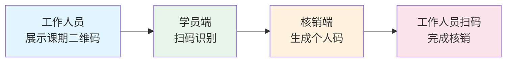
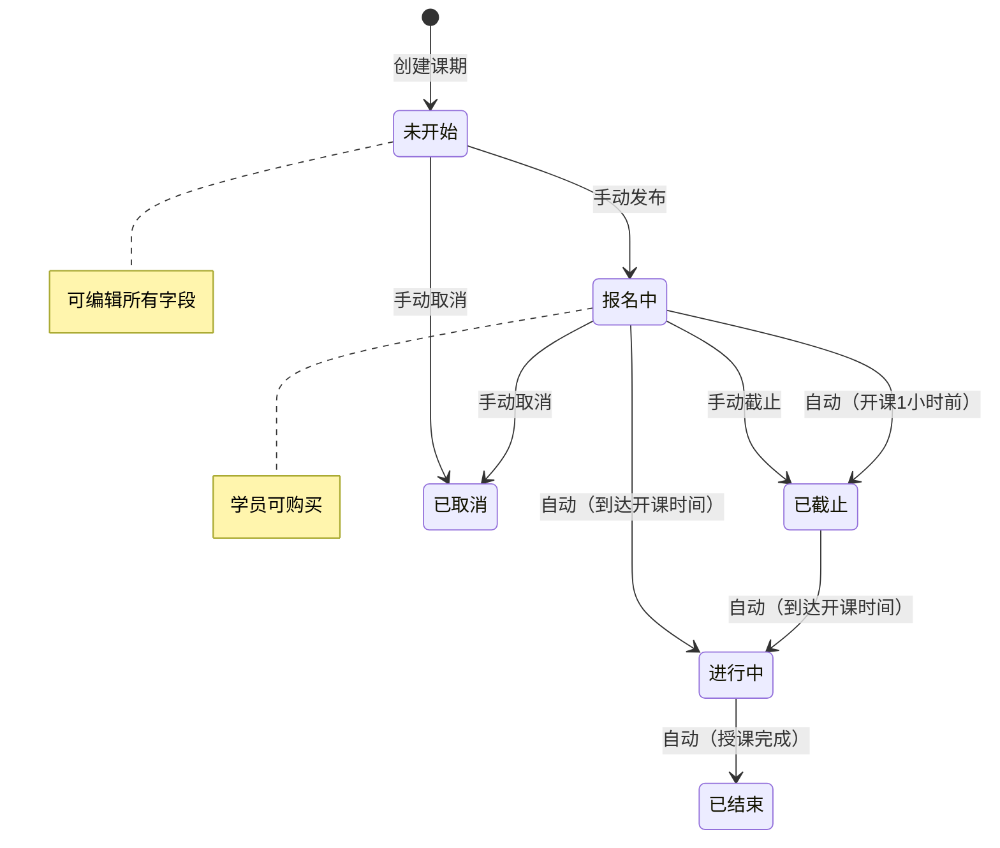
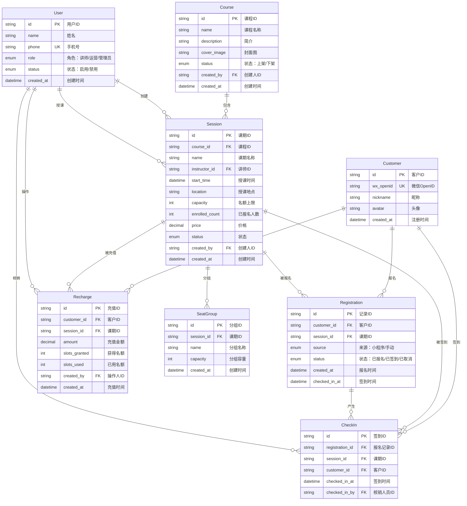
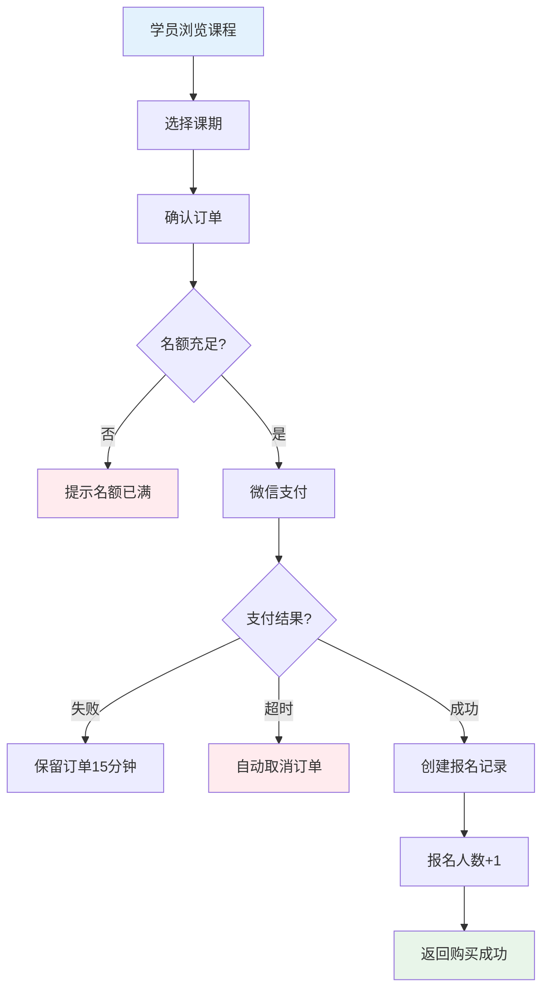
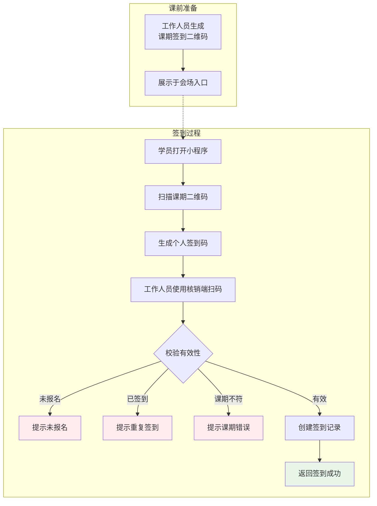
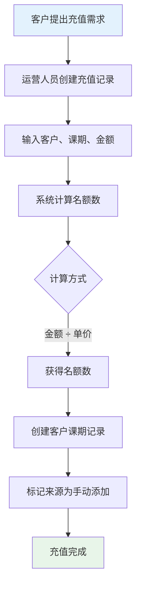

# 课程培训平台 - 产品需求文档 (PRD)

**版本**: v1.0

**日期**: 2026-04-20

**状态**: 初稿

---

## 1. 产品概述

### 1.1 产品定位

面向职业技能培训的 B2C 课程平台，支持微信小程序端用户购课、签到，以及后台管理系统进行课程运营和学员管理。

### 1.2 目标用户

- **学员**：通过微信小程序购买课程、参与培训的 C 端用户
- **讲师**：授课并在后台查看课期学员的专业人士
- **运营人员**：负责课程上下架、课期安排的工作人员
- **管理员**：拥有系统全部权限，管理账号和基础数据

### 1.3 核心价值

1. **便捷购课**：微信小程序内完成浏览、下单、支付全流程
2. **智能签到**：二维码双扫机制，防止代签，确保到场真实性
3. **灵活运营**：支持多课期管理、充值预购、座位分组等功能

---

## 2. 用户角色与权限

| 角色 | 权限范围 |
|------|----------|
| **学员** | 浏览课程、购买课期、扫码签到、查看已购课期 |
| **讲师** | 查看自己授课的课期、查看课期学员列表、查看签到情况 |
| **运营人员** | 课程管理（增删改查）、课期管理、客户管理、客户课期管理、会场座位管理 |
| **管理员** | 全部权限 + 账号管理（创建/禁用工作人员账号）、数据导出 |

---

## 3. 功能模块

### 3.1 微信小程序（C 端）

#### 3.1.1 用户注册

- 微信用户首次进入小程序，自动完成注册
- 注册信息：微信 OpenID、昵称、头像、注册时间

#### 3.1.2 课程浏览

- 课程列表：展示所有上架课程（名称、简介、封面、价格区间）
- 课程详情：课程介绍、课期列表、价格、名额情况

#### 3.1.3 课期购买

- 选择课期 → 确认订单 → 微信支付 → 购买成功
- 购买成功后，客户课期记录自动创建

#### 3.1.4 我的课期

- 展示已购买的课期列表（按时间倒序）
- 课期状态：待上课、进行中、已完成
- 签到入口：课期详情页展示专属签到二维码

#### 3.1.5 扫码签到

**流程设计（双二维码防代签机制）：**

1. 工作人员在后台生成课期签到二维码
2. 学员使用小程序扫描课期二维码，生成个人专属签到二维码（含学员 ID、课期 ID、时间戳）
3. 工作人员使用核销端扫描学员个人二维码，完成签到

---

### 3.2 后台管理系统（B 端）

#### 3.2.1 客户管理

- **客户列表**：展示所有注册客户（微信昵称、头像、注册时间、购买次数）
- **客户详情**：基本信息、购买记录、签到记录
- **手动添加**：运营人员可手动录入客户（用于线下转化场景）

#### 3.2.2 课程管理

**课程（Course）**

- 字段：课程 ID、课程名称、课程简介、封面图、创建人、创建时间、状态（上架/下架）
- 操作：新增、编辑、上架、下架、删除（无关联课期时）

**课期（Session）**

- 字段：课期 ID、所属课程、课期名称、讲师、授课时间、地点、名额、报名人数、课程价格、状态、创建人、创建时间
- 操作：新增、编辑、取消、删除（无报名记录时）

**课期状态流转：**

- **未开始**：课期创建后的初始状态，可编辑所有字段
- **报名中**：学员可购买，运营人员可手动设为「已截止」
- **已截止**：停止报名，自动或手动触发
- **进行中**：到达授课时间自动切换
- **已结束**：授课完成（自动）
- **已取消**：手动取消，已购学员需线下处理

#### 3.2.3 签到管理

- **签到二维码生成**：为每个课期生成唯一签到二维码
- **签到记录**：查看课期签到列表（学员、签到时间）
- **手动签到**：运营人员可为特殊情况手动标记签到

#### 3.2.4 会场座位

- **分组管理**：为课期创建座位分组（如 A 组、B 组、VIP 区）
- **学员分配**：将报名学员分配到指定分组
- **用途**：现场组织、分组讨论、座位引导

#### 3.2.5 课程充值

- **充值记录**：记录客户对课期的预充值
- **名额计算**：充值金额 ÷ 课期单价 = 可用名额
- **使用场景**：企业团购、家长为孩子预存课时

#### 3.2.6 客户课期管理（培训报名）

- **报名记录**：客户与课期的关联记录
- **来源标记**：小程序购买 / 手动添加
- **状态**：已报名 / 已签到 / 已取消

#### 3.2.7 账号管理（仅管理员）

- **工作人员列表**：讲师、运营人员账号管理
- **角色分配**：创建账号时指定角色
- **状态控制**：启用 / 禁用账号

---

## 4. 数据模型

### 4.1 核心实体关系

### 4.2 字段定义

**Customer（客户）**

| 字段 | 类型 | 说明 |
|------|------|------|
| id | string | 客户 ID |
| wx_openid | string | 微信 OpenID |
| nickname | string | 微信昵称 |
| avatar | string | 头像 URL |
| created_at | datetime | 注册时间 |

**Course（课程）**

| 字段 | 类型 | 说明 |
|------|------|------|
| id | string | 课程 ID |
| name | string | 课程名称 |
| description | text | 课程简介 |
| cover_image | string | 封面图 URL |
| status | enum | 状态：上架/下架 |
| created_by | string | 创建人 ID |
| created_at | datetime | 创建时间 |

**Session（课期）**

| 字段 | 类型 | 说明 |
|------|------|------|
| id | string | 课期 ID |
| course_id | string | 所属课程 ID |
| name | string | 课期名称（如：第 1 期） |
| instructor_id | string | 讲师 ID |
| start_time | datetime | 授课时间 |
| location | string | 授课地点 |
| capacity | int | 名额上限 |
| enrolled_count | int | 已报名人数 |
| price | decimal | 课程价格（元） |
| status | enum | 状态：未开始/报名中/已截止/进行中/已结束/已取消 |
| created_by | string | 创建人 ID |
| created_at | datetime | 创建时间 |

**Registration（客户课期/报名记录）**

| 字段 | 类型 | 说明 |
|------|------|------|
| id | string | 记录 ID |
| customer_id | string | 客户 ID |
| session_id | string | 课期 ID |
| source | enum | 来源：小程序/手动添加 |
| status | enum | 状态：已报名/已签到/已取消 |
| created_at | datetime | 报名时间 |
| checked_in_at | datetime | 签到时间 |

**CheckIn（签到记录）**

| 字段 | 类型 | 说明 |
|------|------|------|
| id | string | 签到 ID |
| registration_id | string | 报名记录 ID |
| session_id | string | 课期 ID |
| customer_id | string | 客户 ID |
| checked_in_at | datetime | 签到时间 |
| checked_in_by | string | 核销人员 ID |

**Recharge（课程充值）**

| 字段 | 类型 | 说明 |
|------|------|------|
| id | string | 充值 ID |
| customer_id | string | 客户 ID |
| session_id | string | 课期 ID |
| amount | decimal | 充值金额 |
| slots_granted | int | 获得名额数 |
| slots_used | int | 已使用名额 |
| created_by | string | 操作人 ID |
| created_at | datetime | 充值时间 |

**SeatGroup（会场座位分组）**

| 字段 | 类型 | 说明 |
|------|------|------|
| id | string | 分组 ID |
| session_id | string | 课期 ID |
| name | string | 分组名称 |
| capacity | int | 分组容量 |
| created_at | datetime | 创建时间 |

---

## 5. 关键业务流程

### 5.1 购课流程

**异常处理：**

- 支付超时：订单自动取消，释放名额
- 名额不足：下单时校验，提示「名额已满」
- 支付失败：保留订单 15 分钟，允许重新支付

### 5.2 签到流程

**校验规则：**

- 学员必须已报名该课期
- 每个学员每课期只能签到一次
- 不限制签到时间（课前课后均可，由现场灵活控制）

### 5.3 充值流程

---

## 6. 接口规范（关键接口）

### 6.1 小程序端

| 接口 | 方法 | 说明 |
|------|------|------|
| /api/courses | GET | 获取课程列表 |
| /api/courses/:id | GET | 获取课程详情 |
| /api/sessions/:id | GET | 获取课期详情 |
| /api/orders | POST | 创建订单 |
| /api/payments | POST | 发起微信支付 |
| /api/registrations | GET | 获取我的课期 |
| /api/checkin/qrcode | GET | 获取课期签到二维码（扫码用） |
| /api/checkin/generate | POST | 生成个人签到码 |

### 6.2 管理后台

| 接口 | 方法 | 说明 |
|------|------|------|
| /api/admin/courses | CRUD | 课程管理 |
| /api/admin/sessions | CRUD | 课期管理 |
| /api/admin/customers | CRUD | 客户管理 |
| /api/admin/registrations | CRUD | 客户课期管理 |
| /api/admin/checkin/qrcode | GET | 生成课期签到二维码 |
| /api/admin/checkin/verify | POST | 扫码核销 |
| /api/admin/recharges | POST | 课程充值 |
| /api/admin/seat-groups | CRUD | 会场座位分组 |

---

## 7. 非功能需求

### 7.1 性能要求

- 课程列表加载 < 1s
- 支付流程完成 < 3s
- 签到核销响应 < 500ms

### 7.2 安全要求

- 微信支付签名验证
- 管理后台接口 JWT 认证
- 敏感操作（充值、取消课期）需二次确认

### 7.3 兼容性

- 微信小程序：基础库 2.19.0+
- 管理后台：Chrome 90+, Safari 14+

---

## 8. 附录

### 8.1 术语表

| 术语 | 说明 |
|------|------|
| 课程 | 抽象的课程类型，如「Python 入门」 |
| 课期 | 课程的具体实例，如「Python 入门 -2026 年 4 月班」 |
| 客户 | 在小程序注册的用户 |
| 报名 | 客户购买课期后产生的关联记录 |
| 充值 | 预付费购买多个名额的方式 |

---

**文档变更记录**

| 版本   | 日期         | 变更内容 | 作者  |
| ---- | ---------- | ---- | --- |
| v1.0 | 2026-04-20 | 初稿完成 | -   |