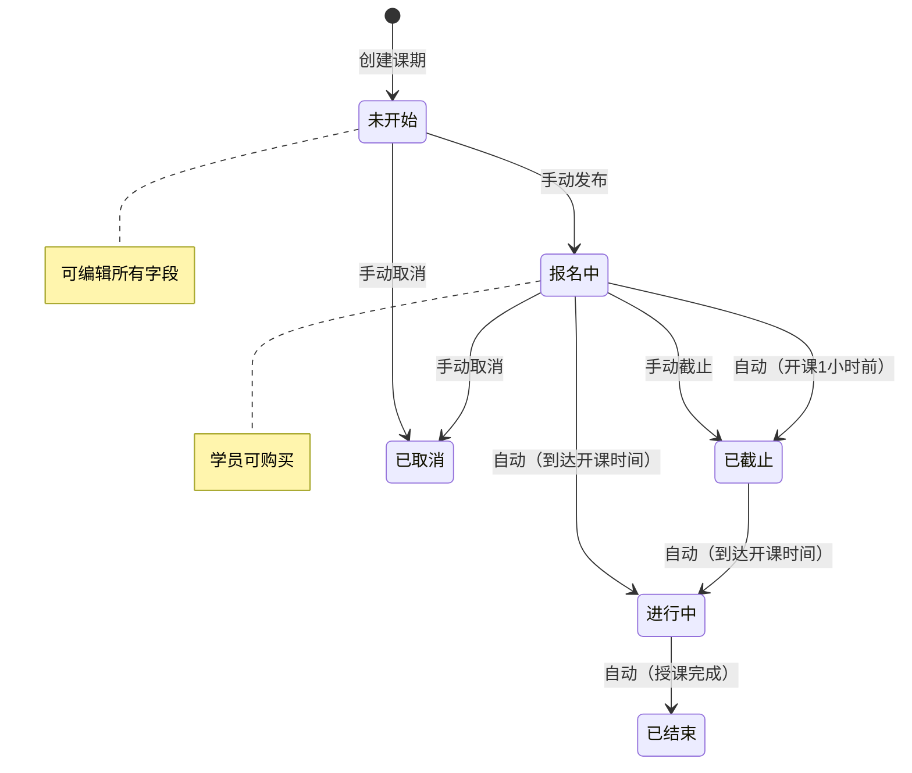
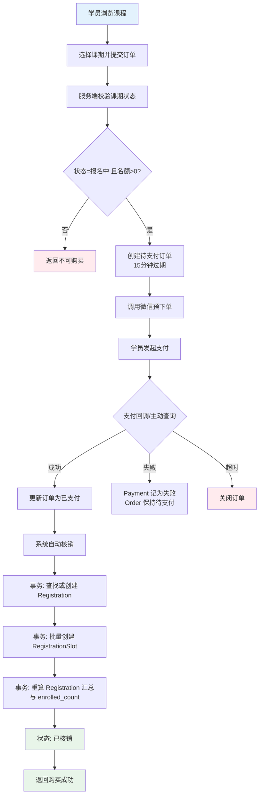
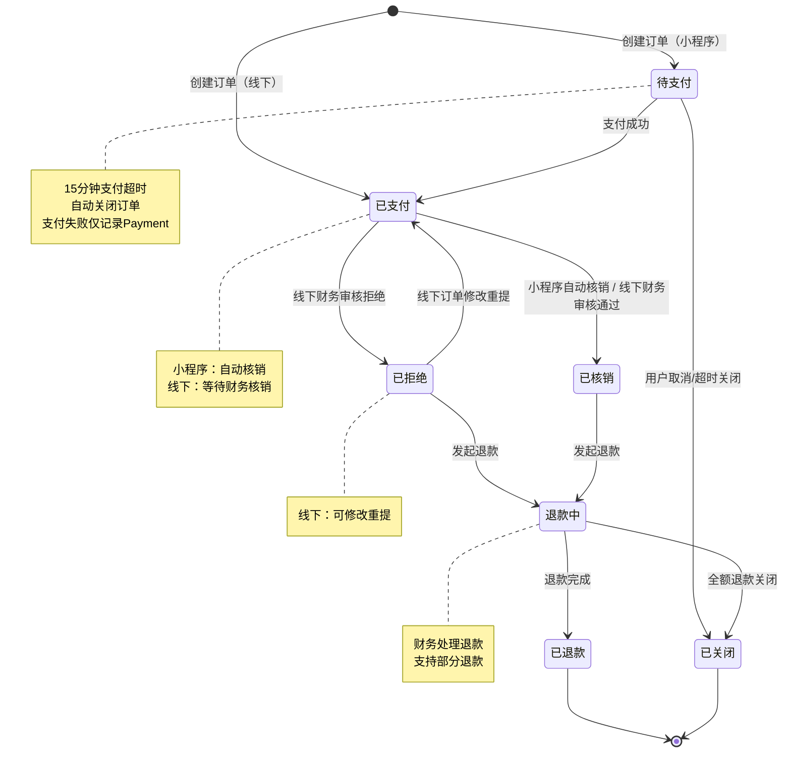
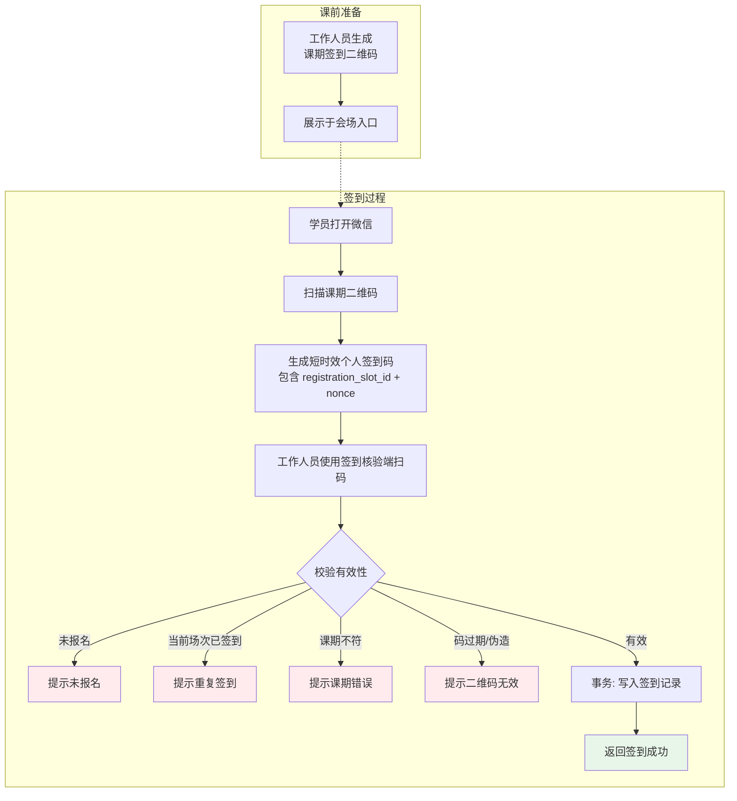
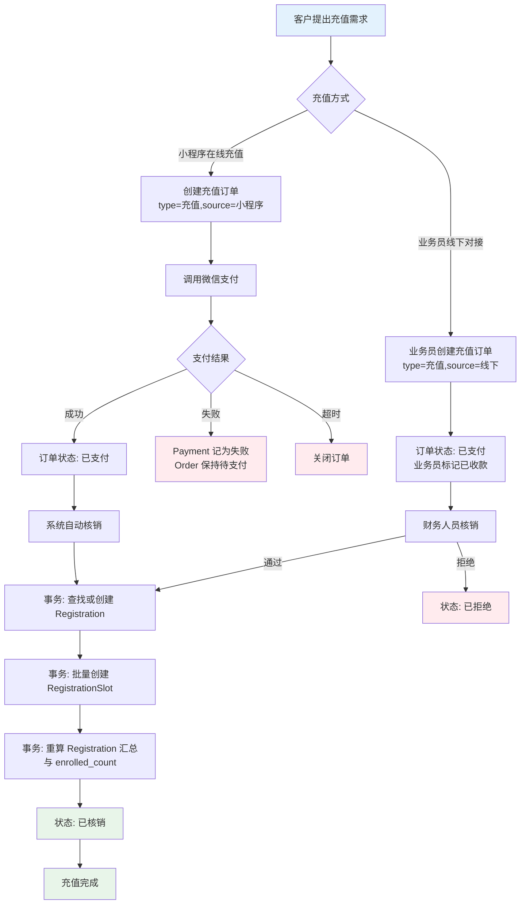
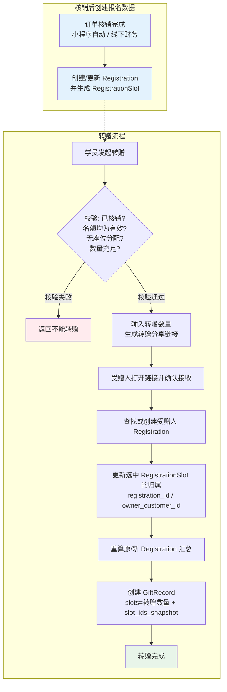
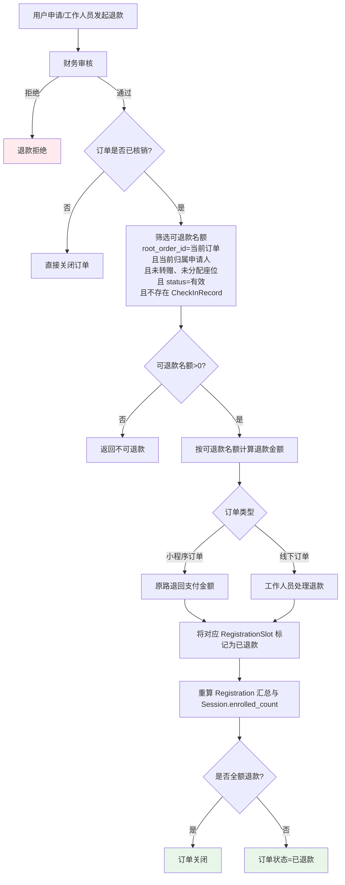

# 课程培训平台 - 产品需求文档 (PRD)

**版本**: v1.6

**日期**: 2026-04-22

**状态**: 修订稿

------

## 1. 产品概述

### 1.1 产品定位

面向职业技能培训的 B2C 课程平台，支持微信小程序端用户购课、签到，以及后台管理系统进行课程运营和学员管理。

### 1.2 目标用户

- **学员**：通过微信小程序下单、查看订单、参与培训的 C 端用户
- **讲师**：授课并在后台查看自己课期学员与签到情况的专业人士
- **运营人员**：负责课程上下架、课期安排、客户资料维护、签到管理、座位管理的工作人员
- **业务员**：负责客户对接、课程销售、线下订单录入、客户绑定和业绩跟进的工作人员，仅管理自己绑定的客户数据
- **财务人员**：负责订单核销、退款处理、财务对账的工作人员
- **管理员**：拥有系统全部权限，管理账号、分配权限

   ------

## 2. 用户角色与权限

   | 角色         | 权限范围                                                     |
   | :----------- | :----------------------------------------------------------- |
   | **学员**     | 浏览课程、下单支付、查看我的订单、查看已生效课期、扫码签到、发起转赠、发起退款申请 |
   | **讲师**     | 查看自己授课的课期、查看课期学员列表、查看签到情况           |
   | **运营人员** | 客户资料维护、课程/课期管理、签到管理、会场座位管理、客户课期查询 |
   | **业务员**   | 客户管理（仅自己绑定的客户）、课程推荐、线下创建订单、查看个人业绩统计、查看自己客户的课期信息 |
   | **财务人员** | 订单核销、退款处理、财务报表查看                             |
   | **管理员**   | 全部权限 + 账号管理（创建/禁用工作人员账号）、权限分配（可为非管理员用户设置角色如财务、业务员等）、数据导出 |

### 2.1 术语与状态映射

- **订单核销**：订单支付完成后的生效确认动作。小程序订单为系统自动核销，线下订单为财务人工核销。
- **签到核验**：上课现场按场次扫码确认签到的动作，不等同于订单核销。
- **已核销（订单状态）**：订单已完成生效，可生成/使用名额。
- **待核销（前端展示文案）**：对应订单状态 `已支付` 的展示名。
- **已生效（前端展示文案）**：对应订单状态 `已核销` 的展示名。

------

## 3. 功能模块

### 3.1 微信小程序（C 端）

#### 3.1.1 用户注册

   - 登录方式：微信授权登录（获取 OpenID）
   - 微信用户首次进入小程序，自动完成注册
   - 注册信息：微信 OpenID、昵称、头像、注册时间
   - 首次报名前若未完善上课信息，需先补充客户详细信息后方可下单

#### 3.1.2 课程浏览

   - 课程列表：展示所有上架课程（名称、简介、封面、价格区间）
   - 课程详情：课程介绍、课期列表、价格、名额情况

#### 3.1.3 课期购买

   - 选择课期 → 确认订单 → 微信支付 → 系统自动核销（订单状态=已核销，即已生效）
   - 报名前校验：若客户未填写上课信息，先进入信息完善流程，提交后方可继续报名
   - 购买名额数量可自选（例如购买 2 个名额后转赠 1 个给朋友）
   - 个人可购买名额上限由两部分共同约束：`课期单人购课上限` 与 `课期剩余可售名额`
   - 支付成功后订单先进入「已支付」，小程序订单随即自动核销并创建客户课期记录与名额明细；后台由业务员上传的支付订单信息需财务核销通过后才创建客户课期记录与名额明细

#### 3.1.4 我的订单

   - 展示订单列表（按创建时间倒序）
   - 订单状态：待支付、已支付、已核销、已拒绝、退款中、已退款、已关闭
   - 状态展示映射：`已支付` 在小程序展示为「待核销」，`已核销` 展示为「已生效」
   - 支持查看订单支付时间、核销进度、拒绝原因、退款进度
   - 订单详情支持查看：课程名称、上课时间、课期信息、本人签到记录（含签到时间/场次）
   - 订单详情展示关联课期进度：待上课、进行中、已上课（从课期状态映射）

#### 3.1.5 我的课期

   - 仅展示已核销生效且当前仍持有有效名额的课期列表（按时间倒序）
   - 课期状态：待上课、进行中、已完成
   - 使用明细：可查看名额使用流水（签到记录、转赠记录、退款记录）
   - **转赠管理**：可查看自己转赠给他人的记录，以及他人转赠给自己的记录
   - 充值：可以在已经购买的课期上面继续购买名额，比如：我当前购买了两个名额，然后突然又有一个好友想一起上课，则可以在这里继续购买；依然受限于与`课期单人购课上限` 与 `课期剩余可售名额`；
   - **名额转赠功能（小程序）**：仅已核销且仍有效的名额可转赠；发起人生成分享链接，受赠人点击确认后生效；生效后，客户可用名额减少；

#### 3.1.6 扫码签到

   **流程设计（双二维码防代签机制）：**

1. 工作人员在后台生成课期签到二维码
2. 学员使用小程序扫描课期二维码，服务端为其锁定一个可签到的有效名额，生成个人专属签到二维码（含 registration_slot_id、学员 ID、时间戳）
3. 工作人员使用签到核验端扫描学员个人二维码，完成签到核验；可选择核验场次，比如一个课期有两天，分第一天上午、第一天下午、第二天上午、第二天下午这种，不同场次分别扫码；（该签到核验链接由后台生成，即一个课期生成一个核验链接）

------

### 3.2 后台管理系统（B 端）

#### 3.2.1 客户管理

- **客户列表**：展示所有注册客户（微信昵称、头像、注册时间、购买次数）
- **客户详情**：基本信息、订单记录、已生效课期、签到记录、**绑定业务员**、上课信息
- **上课信息字段**：抖音号、当前月收入、学习目标、备注、信息完善时间
- **手动添加**：运营人员可手动录入客户（用于线下转化场景）
- **业务员绑定**：每个客户可绑定一个业务员，用于业务员业绩统计

#### 3.2.2 课程管理

- 一个课程下面可以有多个课期

**课程（Course）**

- 字段：课程 ID、课程名称、课程简介、封面图、创建人、创建时间、状态（上架/下架）、归属类别、排序优先级
- 操作：新增、编辑、上架、下架、删除（无关联课期时）

**课期（Session）**

- 字段：课期 ID、所属课程、课期名称、讲师、授课时间、地点、名额、报名人数、课程价格、单人购课上限、状态、创建人、创建时间
- 操作：新增、编辑、取消、删除（无报名记录时）

**课期状态流转：**

- **未开始**：课期创建后的初始状态，可编辑所有字段
- **报名中**：学员可下单，运营人员可手动设为「已截止」
- **已截止**：停止报名，自动或手动触发
- **进行中**：到达授课时间自动切换
- **已结束**：授课完成（自动）
- **已取消**：手动取消，已购学员进入退款或改期流程，退款由财务审核处理

#### 3.2.3 签到管理

- **签到二维码生成**：为每个课期生成唯一签到二维码（用户通过微信扫码后，会生成用户的标识码）
- **签到核验链接**：为每个课期生成唯一签到核验链接，由业务员使用该链接扫描用户标识码确认签到（链接内支持按场次核验，每天可配置上午场/下午场）
- **签到记录**：查看课期签到列表（学员、名额、场次、签到时间、签到操作人）
- **手动签到**：业务员可为特殊情况按名额+场次手动标记签到

#### 3.2.4 会场座位

- **分组管理**：为课期创建座位分组（如 1 组、2 组、3 组 或 A 组、B 组、C 组）
- **学员分配**：工作人员按已生效名额将学员分配到指定分组
- **转赠学员分组**：转赠的学员可与其赠送人分配在同一分组，便于现场组织
- **用途**：现场组织、分组讨论、座位引导

#### 3.2.5 课程充值

- **充值**：客户对指定课期预存名额，支持小程序充值和业务员线下创建
- **补充名额**：可在已购买课期上继续购买额外名额，用于本人后续使用或转赠；业务员可以后台帮助用户进行转赠，被转赠人只能是已注册用户
- **名额计算**：充值金额 ÷ 课期单价 = 名额数
- **使用场景**：企业团购、家长为孩子预存课时
- **使用明细**：支持按课期查看名额使用流水（转赠、签到、退款）
- **统一订单模式**：购课和充值都走 Order 表；线下订单需财务核销后生效，小程序购课与充值订单支付成功后自动核销生效
- **业务员线下充值**：业务员为客户手动创建充值订单，直接标记为已支付（现金/转账已收），等待财务核销
- **财务核销**：线下订单（购课/充值）支付成功后状态为已支付，财务人员核销后变为已核销，同时创建报名汇总和名额明细；小程序购课与充值订单支付成功后自动核销并创建报名汇总和名额明细
- **退款处理**：仅支持退订单下仍归属于当前客户、未转赠、未分配座位且无任何签到记录（CheckInRecord）的剩余名额，已转赠部分不可退款

#### 3.2.6 客户课期管理（培训报名）

- **报名汇总（Registration）**：按客户 + 课期 + 业绩归属业务员聚合的报名记录
- **名额明细（RegistrationSlot）**：每个已核销名额一条记录，作为签到、座位、转赠、退款的最小操作单元
- **状态**：Registration = 有效 / 已清空 / 已取消；RegistrationSlot = 有效 / 已退款 / 已取消（不包含“已签到”状态）
- **业务员业绩**：按名额明细的根业务员归属统计，转赠不改变业绩归属
- SessionSegment 创建：课期创建时默认生成一个「全场次」，工作人员可再添加其他场次（如上午场、下午场）
- **签到记录模型（CheckInRecord）**：按“名额 + 场次”记录签到事实；建议字段：`id`、`registration_slot_id`、`session_id`、`session_segment_id`、`checked_in_at`、`checked_in_by`、`source(扫码/手动)`；唯一约束：`UNIQUE(registration_slot_id, session_segment_id)`

#### 3.2.7 账号管理（仅管理员）

- **工作人员列表**：讲师、业务员、财务人员账号管理
- **角色分配**：创建账号时指定角色，管理员可随时调整非管理员用户的权限
- **状态控制**：启用 / 禁用账号

------

## 4. 关键业务流程

### 4.1 购课流程

**异常处理：**

- 并发超卖：创建订单时只校验可售状态，自动核销时按名额做最终校验并落明细。
- 重复回调：按 `order_no` 和 `channel_trade_no` 幂等处理，重复通知直接返回成功。
- 支付失败：仅记录在 `Payment.status`，订单保持待支付并允许用户重试，直到超时关闭。
- 支付超时：超过 `expire_at` 自动关闭订单，避免脏订单长期占用资源。
- 核销拒绝（仅线下订单）：财务拒绝后订单状态为"已拒绝"
  - 线下订单：业务员可修改信息后重新提交核销申请
  - 小程序订单：不经过人工核销；若自动核销失败则系统发起原路退款并关闭订单

### 4.2 订单状态流转

**订单状态说明：**

| 状态 | 说明 |
| :--- | :--- |
| **待支付** | 订单创建，等待用户支付（仅小程序订单） |
| **已支付** | 支付成功；小程序订单会自动核销，线下订单等待财务核销 |
| **已关闭** | 订单关闭（取消/超时/全额退款） |
| **已核销** | 小程序自动核销或线下财务审核通过后，报名汇总与名额明细生效 |
| **已拒绝** | 仅线下订单可能出现：财务审核拒绝，等待处理 |
| **退款中** | 退款申请处理中 |
| **已退款** | 部分退款完成，订单仍保留已生效部分 |

**退款独立记录：**

| 字段 | 说明 |
| :--- | :--- |
| id | 退款记录ID |
| order_id | 关联订单ID |
| amount | 退款金额 |
| type | 类型：全额/部分 |
| channel | 渠道：原路退回/线下处理 |
| reason | 退款原因 |
| handled_by | 处理人ID |
| created_at | 退款时间 |

**退款规则：**
- 未核销订单：直接退款，订单关闭，不产生报名数据
- 已核销订单全额退款：退款该订单下全部可退款名额，订单关闭
- 已核销订单部分退款：仅退款该订单下部分可退款名额，订单变为"已退款"
- 线下订单退款：财务手动处理，记录日志

### 4.3 签到流程

**校验规则：**

- 学员必须持有该课期至少一个 `status=有效` 的名额
- 每个名额每场次只能签到一次，同一课期不同场次可重复签到（通过 `UNIQUE(registration_slot_id, session_segment_id)` 保证）
- 签到核验时服务端锁定一个有效名额并写入 `CheckInRecord`，不修改 `RegistrationSlot.status`
- 个人签到码有效期可配置（默认 120 秒），完成签到核验后立即失效，防截图转发
- 不限制签到时间（课前课后均可，由现场灵活控制）

### 4.4 充值流程（统一订单模式）

### 4.5 名额转赠流程

**转赠规则：**
- 核销后才能转赠（Order.status = 已核销）
- 支持部分转赠、多次转赠（不限制次数）
- 仅 `RegistrationSlot.status = 有效` 且未分配座位的名额可转赠
- 业绩始终归属最开始的业务员（Registration.sales_agent_id 和 RegistrationSlot.sales_agent_id 不变）
- 转赠通过分享链接发起，受赠人点击确认后生效

**转赠链限制：**
- 不支持转赠链，仅支持 A→B，受赠人不可继续转赠该名额
- 发起人可对自己仍持有的有效名额多次发起转赠
- 每次转赠都创建新的 GiftRecord，必要时为受赠人创建新的 Registration
- 所有转赠产生的 Registration 和 RegistrationSlot 业绩都归属最开始的业务员
- `active_slots=0` 且 `total_slots=0` 的 Registration 标记为「已清空」，不在小程序展示，但保留审计记录

### 4.6 退款流程

**退款规则：**

- 退款入口：小程序用户申请 或 后台工作人员发起
- 已核销订单可退款，但仅针对该订单下当前仍归属于申请人、未转赠、未分配座位且无任何签到记录（CheckInRecord）的名额
- 退款金额按可退款名额数量 × 原始单价计算
- 转赠后仅支持退剩余未转赠部分（如购买5个名额，转赠2个，只可退3个）
- 线下订单退款由工作人员处理，记录日志即可

**退款处理细节：**
- 已核销订单退款：仅标记对应 RegistrationSlot 为已退款，并重算 Registration 汇总与 Session.enrolled_count
- 未核销订单退款：直接关闭订单，无需恢复名额
- 部分退款（转赠后）：按剩余可退款名额数量计算退款金额
- 线下订单：财务手动处理，系统记录退款日志

## 5 设计决策汇总

以下是在需求确认过程中明确的关键决策：

**转赠机制**
- 转赠时机：核销后才能转赠（Order.status = 已核销）
- 转赠方式：发起人生成分享链接，受赠人确认后生效，并记录 GiftRecord 日志
- 支持部分转赠、多次转赠，不支持转赠链，只能 A 转赠到 B；
- 仅有效且未分配座位的名额可转赠，转赠以 RegistrationSlot 为最小单位
- 业绩始终归属最开始的业务员（Registration.sales_agent_id、RegistrationSlot.sales_agent_id 不变）
- `active_slots=0` 且 `total_slots=0` 的 Registration 标记为「已清空」，不在小程序展示

**报名前信息完善**

- 首次报名前必须完善上课信息（抖音号、月收入区间、学习目标等）
- 未完善信息时，报名流程强制跳转至信息完善页

**购课数量约束**
- 支持单订单多名额购买
- 实际可购买数量受 `Session.per_user_slot_limit` 与课期剩余可售名额共同约束

**签到机制**
- SessionSegment：课期创建时默认生成一个「全场次」，工作人员可再添加其他场次
- 签到码有效期：可配置，默认 120 秒
- 签到数据：`RegistrationSlot` 不记录签到状态，签到事实统一记录在 `CheckInRecord`
- 签到校验：唯一约束 `CheckInRecord(registration_slot_id, session_segment_id)` 防止同一名额在同一场次重复签到

**座位分配**
- 工作人员按已生效名额将学员分配到指定分组
- 转赠的学员可与其赠送人分配在同一分组

**退款机制**
- 退款入口：小程序用户申请 或 后台工作人员发起
- 退款状态：退款中 → 已退款（部分）/ 已关闭（全额）
- 已核销订单可退款，但仅处理该订单下可退款的 RegistrationSlot
- 退款金额按可退款名额数量 × 原始单价计算
- 转赠后仅支持退剩余未转赠部分（如购买5个名额，转赠2个，只可退3个）
- 退款独立记录，支持多次部分退款
- 线下订单退款由工作人员处理，记录日志即可

**已拒绝处理**

- 线下订单：业务员可修改信息后重新提交核销申请
- 小程序订单：不走人工核销；若自动核销失败，系统自动原路退款并关闭订单

**线下充值**

- 业务员为客户手动创建充值订单，填写付款订单号，付款截图等，直接标记为已支付（现金/转账已收），等待财务核销
- 客户无需在线支付，订单直接进入财务核销流程
