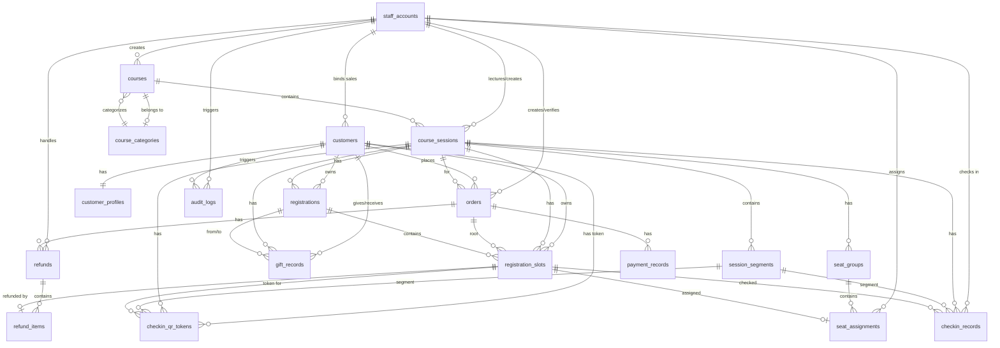

# 课程培训平台数据库设计文档

## 1. 设计目标

- 支持课程购买与充值统一订单模型
- 支持小程序自动核销、线下财务核销
- 支持一个课期多场次签到（如上午/下午）
- 支持名额转赠（禁止转赠链）
- 支持部分退款与退款明细追踪
- 支持会场分组与按名额分配

## 2. 核心实体与表清单

### 2.1 账号与用户

1. `staff_accounts`：后台工作人员账号（管理员/运营/业务/财务/讲师）
2. `customers`：C 端学员用户
3. `customer_profiles`：学员上课资料（抖音号、收入区间、学习目标等）

### 2.1.1 课程分类

1. `course_categories`：课程分类（后台可配置，运营人员可增删改）

### 2.2 课程与课期

1. `courses`：课程主数据
2. `course_sessions`：课期（时间、地点、容量、价格、状态）
3. `session_segments`：课期场次（默认全场次，可扩展上午/下午）

### 2.3 订单与支付

1. `orders`：统一订单（购课/充值）
2. `payment_records`：支付流水（支持重试与回调幂等）

### 2.4 报名与名额

1. `registrations`：客户在课期上的报名汇总
2. `registration_slots`：名额明细（最小业务单元）

### 2.5 签到

1. `checkin_records`：签到事实表（按名额+场次）
2. `checkin_qr_tokens`：短时效个人签到码

### 2.6 审计日志

1. `audit_logs`：敏感操作审计日志（财务核销、退款审批、转赠、座位分配、价格修改等）

### 2.7 转赠

1. `gift_records`：名额转赠记录

### 2.8 退款

1. `refunds`：退款主单
2. `refund_items`：退款名额明细

### 2.9 会场分组

1. `seat_groups`：课期分组
2. `seat_assignments`：名额分组分配

## 3. 关键字段约定

### 3.1 订单状态（`orders.status`）

- `pending_payment`：待支付
- `paid`：已支付
- `verified`：已核销（已生效）
- `rejected`：已拒绝（仅线下）
- `refunding`：退款中
- `refunded`：已退款（部分或全部）
- `closed`：已关闭

### 3.2 名额状态（`registration_slots.status`）

- `active`：有效
- `refunded`：已退款
- `cancelled`：已取消

说明：名额不记录“已签到”状态，签到事实由 `checkin_records` 记录。

### 3.3 签到唯一约束

- 唯一键：`(registration_slot_id, session_segment_id)`
- 含义：同一名额在同一场次只能签到一次；不同场次可签到。

### 3.4 转赠约束（禁止转赠链）

- 通过 `registration_slots.gift_level` 标识该名额是否已转赠过
- 规则：仅 `gift_level = 0` 且 `status = active` 且未分配座位的名额可被转赠，转赠后置为 `1`
- 效果：支持 A→B，不支持 B→C
- 转赠链接状态由 `gift_records.status` 管理：`pending`（待确认）、`accepted`（已确认）、`expired`（24 小时过期）、`cancelled`（发起人主动取消）
- 名额转赠状态由 `registration_slots.gift_status` 管理：`0`（可转赠）、`1`（转赠中，链接已发出未确认）、`2`（已转赠，受赠人已确认）
- 发起转赠时：`gift_status` 置为 `1`；受赠人确认后：`gift_status` 置为 `2`，`gift_level = 1`；转赠过期/取消时：`gift_status` 恢复为 `0`

## 4. 主外键关系（文字版）

1. `course_categories` 1:N `courses`
2. `courses` 1:N `course_sessions`
3. `course_sessions` 1:N `session_segments`
4. `customers` 1:N `orders`
5. `orders` 1:N `payment_records`
6. `customers` 1:N `registrations`
7. `registrations` 1:N `registration_slots`
8. `orders` 1:N `registration_slots`（通过 `root_order_id` 回溯来源订单）
9. `registration_slots` 1:N `checkin_records`
10. `session_segments` 1:N `checkin_records`
11. `refunds` 1:N `refund_items`
12. `registration_slots` 1:0..1 `refund_items`
13. `course_sessions` 1:N `seat_groups`
14. `registration_slots` 1:0..1 `seat_assignments`
15. `seat_groups` 1:N `seat_assignments`

## 5. ER 关系图

## 6. 业务规则落地建议

1. `course_sessions.enrolled_count` 使用事务更新，并配套定时对账任务修正。
2. 退款可退名额筛选条件统一为：
   - `registration_slots.status = active`
   - `registration_slots.owner_customer_id = 申请人`
   - `registration_slots.root_customer_id = 申请人`（仅原始购买人可退款，转赠获得的名额不可退）
   - 未分配座位
   - 不存在 `checkin_records`
   - `registration_slots.gift_level = 0`（未转赠）
   - `registration_slots.gift_status = 0`（非转赠中状态）
3. 小程序订单支付成功后自动核销；线下订单由财务审核核销。
4. 转赠时保持业绩归属不变（`sales_agent_id` 沿用根归属）。
5. `course_categories` 删除时：若存在关联课程则禁止删除。
6. `registration_slots.gift_level`：仅 `gift_level = 0` 且 `gift_status = 0` 且 `status = active` 且未分配座位的名额可被转赠，转赠后置 `gift_level = 1`、`gift_status = 2`，禁止转赠链（A→B 后 B 不可继续转赠）。
   - 发起转赠时 `gift_status` 置为 `1`；受赠人确认后 `gift_status = 2`、`gift_level = 1`；转赠过期/取消时 `gift_status` 恢复为 `0`
7. 客户注册时可绑定业务员（非必填），注册后管理员/运营可在后台为客户绑定或更换业务员；业绩归属以订单创建时客户绑定的业务员为准。
8. `checkin_qr_tokens`：扫码签到流程中，学员扫描课期二维码后生成个人签到码（短时效令牌），工作人员扫码学员个人码完成签到核验后标记 `consumed_at`，该码立即失效。

## 7. 字段级数据字典

### 7.1 `staff_accounts`（后台账号）

| 字段名 | 类型 | 必填 | 业务说明 |
| :--- | :--- | :--- | :--- |
| id | bigint | 是 | 主键ID |
| username | varchar(64) | 是 | 登录账号，唯一 |
| password_hash | varchar(255) | 是 | 密码哈希 |
| display_name | varchar(64) | 是 | 显示名称 |
| role | enum(admin,operations,sales,finance,lecturer) | 是 | 账号角色 |
| status | enum(enabled,disabled) | 是 | 账号状态 |
| created_at | datetime | 是 | 创建时间 |
| updated_at | datetime | 是 | 更新时间 |

### 7.2 `customers`（学员）

| 字段名 | 类型 | 必填 | 业务说明 |
| :--- | :--- | :--- | :--- |
| id | bigint | 是 | 主键ID |
| wechat_openid | varchar(128) | 是 | 微信OpenID，唯一 |
| wechat_unionid | varchar(128) | 否 | 微信UnionID |
| nickname | varchar(128) | 否 | 昵称 |
| avatar_url | varchar(512) | 否 | 头像地址 |
| source | enum(wechat_mini_program,manual_import) | 是 | 注册来源 |
| bound_sales_id | bigint | 否 | 绑定业务员ID |
| registered_at | datetime | 是 | 注册时间 |
| created_at | datetime | 是 | 创建时间 |
| updated_at | datetime | 是 | 更新时间 |

### 7.3 `customer_profiles`（学员资料）

| 字段名 | 类型 | 必填 | 业务说明 |
| :--- | :--- | :--- | :--- |
| customer_id | bigint | 是 | 主键，关联客户ID |
| douyin_id | varchar(128) | 否 | 抖音号 |
| monthly_income_range | varchar(64) | 否 | 月收入区间 |
| learning_goal | varchar(512) | 否 | 学习目标 |
| remark | varchar(512) | 否 | 备注 |
| profile_completed_at | datetime | 否 | 信息完善时间 |
| created_at | datetime | 是 | 创建时间 |
| updated_at | datetime | 是 | 更新时间 |

### 7.3.1 `course_categories`（课程分类）

| 字段名 | 类型 | 必填 | 业务说明 |
| :--- | :--- | :--- | :--- |
| id | bigint | 是 | 主键ID |
| name | varchar(64) | 是 | 分类名称 |
| sort_order | int | 是 | 排序优先级 |
| created_at | datetime | 是 | 创建时间 |
| updated_at | datetime | 是 | 更新时间 |

### 7.4 `courses`（课程）

| 字段名 | 类型 | 必填 | 业务说明 |
| :--- | :--- | :--- | :--- |
| id | bigint | 是 | 主键ID |
| name | varchar(128) | 是 | 课程名称 |
| intro | text | 否 | 课程简介 |
| cover_image_url | varchar(512) | 否 | 封面图URL |
| category_id | bigint | 否 | 课程分类ID，关联 course_categories.id |
| sort_priority | int | 是 | 排序优先级 |
| status | enum(draft,online,offline) | 是 | 课程状态（草稿/上架/下架） |
| created_by | bigint | 否 | 创建人（后台账号） |
| created_at | datetime | 是 | 创建时间 |
| updated_at | datetime | 是 | 更新时间 |

### 7.5 `course_sessions`（课期）

| 字段名 | 类型 | 必填 | 业务说明 |
| :--- | :--- | :--- | :--- |
| id | bigint | 是 | 主键ID |
| course_id | bigint | 是 | 所属课程ID |
| name | varchar(128) | 是 | 课期名称 |
| lecturer_id | bigint | 否 | 讲师ID |
| location | varchar(255) | 否 | 上课地点 |
| start_time | datetime | 是 | 开始时间 |
| end_time | datetime | 是 | 结束时间 |
| registration_deadline | datetime | 否 | 报名截止时间 |
| capacity | int | 是 | 容量上限 |
| enrolled_count | int | 是 | 已报名名额数（汇总） |
| price_amount | decimal(10,2) | 是 | 单价 |
| per_user_slot_limit | int | 是 | 单人购课上限 |
| status | enum(not_started,open_for_registration,registration_closed,in_progress,finished,cancelled) | 是 | 课期状态 |
| checkin_verify_url | varchar(512) | 否 | 签到核验链接 |
| created_by | bigint | 否 | 创建人 |
| created_at | datetime | 是 | 创建时间 |
| updated_at | datetime | 是 | 更新时间 |

### 7.6 `session_segments`（课期场次）

| 字段名 | 类型 | 必填 | 业务说明 |
| :--- | :--- | :--- | :--- |
| id | bigint | 是 | 主键ID |
| session_id | bigint | 是 | 课期ID |
| segment_name | varchar(64) | 是 | 场次名称（全场次/上午场/下午场） |
| starts_at | datetime | 否 | 场次开始时间 |
| ends_at | datetime | 否 | 场次结束时间 |
| sort_order | int | 是 | 场次排序 |
| is_default_all | boolean | 是 | 是否默认全场次 |
| created_at | datetime | 是 | 创建时间 |
| updated_at | datetime | 是 | 更新时间 |

### 7.7 `orders`（订单）

| 字段名 | 类型 | 必填 | 业务说明 |
| :--- | :--- | :--- | :--- |
| id | bigint | 是 | 主键ID |
| order_no | varchar(64) | 是 | 订单号，唯一 |
| customer_id | bigint | 是 | 下单客户ID |
| session_id | bigint | 是 | 课期ID |
| type | enum(purchase,recharge) | 是 | 订单类型（购课/充值） |
| source | enum(mini_program,offline) | 是 | 订单来源（小程序/线下） |
| slot_quantity | int | 是 | 名额数量 |
| unit_price_amount | decimal(10,2) | 是 | 单价 |
| total_amount | decimal(10,2) | 是 | 总金额 |
| status | enum(pending_payment,paid,verified,rejected,refunding,refunded,closed) | 是 | 订单状态 |
| payment_deadline_at | datetime | 否 | 支付截止时间 |
| paid_at | datetime | 否 | 支付时间 |
| verified_at | datetime | 否 | 核销时间（自动或人工） |
| verified_by | bigint | 否 | 财务核销人（线下单） |
| rejected_reason | varchar(512) | 否 | 拒绝原因 |
| external_payment_no | varchar(128) | 否 | 线下支付单号 |
| payment_proof_url | varchar(512) | 否 | 线下付款凭证 |
| created_by_staff_id | bigint | 否 | 线下订单创建人（业务员） |
| created_at | datetime | 是 | 创建时间 |
| updated_at | datetime | 是 | 更新时间 |

### 7.8 `payment_records`（支付流水）

| 字段名 | 类型 | 必填 | 业务说明 |
| :--- | :--- | :--- | :--- |
| id | bigint | 是 | 主键ID |
| order_id | bigint | 是 | 订单ID |
| payment_no | varchar(64) | 是 | 支付流水号，唯一 |
| channel | enum(wechat_pay,offline_cash,offline_transfer) | 是 | 支付渠道 |
| channel_trade_no | varchar(128) | 否 | 渠道交易单号 |
| amount | decimal(10,2) | 是 | 本次支付金额 |
| status | enum(pending,success,failed,closed) | 是 | 支付状态 |
| paid_at | datetime | 否 | 到账时间 |
| failed_reason | varchar(512) | 否 | 失败原因 |
| callback_payload | json | 否 | 回调原始报文 |
| created_at | datetime | 是 | 创建时间 |
| updated_at | datetime | 是 | 更新时间 |

### 7.9 `registrations`（报名汇总）

| 字段名 | 类型 | 必填 | 业务说明 |
| :--- | :--- | :--- | :--- |
| id | bigint | 是 | 主键ID |
| customer_id | bigint | 是 | 客户ID |
| session_id | bigint | 是 | 课期ID |
| sales_agent_id | bigint | 否 | 根业务员归属ID |
| total_slots | int | 是 | 总名额数 |
| active_slots | int | 是 | 当前有效名额数 |
| status | enum(active,cleared,cancelled) | 是 | 汇总状态 |
| created_at | datetime | 是 | 创建时间 |
| updated_at | datetime | 是 | 更新时间 |

### 7.10 `registration_slots`（名额明细）

| 字段名 | 类型 | 必填 | 业务说明 |
| :--- | :--- | :--- | :--- |
| id | bigint | 是 | 主键ID |
| registration_id | bigint | 是 | 所属报名汇总ID |
| session_id | bigint | 是 | 课期ID |
| owner_customer_id | bigint | 是 | 当前持有人ID |
| sales_agent_id | bigint | 否 | 根业务员归属ID |
| root_order_id | bigint | 是 | 来源订单ID |
| root_customer_id | bigint | 是 | 原始购买人ID |
| status | enum(active,refunded,cancelled) | 是 | 名额状态 |
| gift_level | tinyint | 是 | 转赠层级（0未转赠，1已转赠） |
| gift_status | tinyint | 是 | 转赠状态（0=可转赠, 1=转赠中, 2=已转赠） |
| gifted_at | datetime | 否 | 转赠完成时间 |
| refunded_at | datetime | 否 | 退款完成时间 |
| cancelled_at | datetime | 否 | 取消时间 |
| created_at | datetime | 是 | 创建时间 |
| updated_at | datetime | 是 | 更新时间 |

### 7.11 `refunds`（退款主单）

| 字段名 | 类型 | 必填 | 业务说明 |
| :--- | :--- | :--- | :--- |
| id | bigint | 是 | 主键ID |
| refund_no | varchar(64) | 是 | 退款单号，唯一 |
| order_id | bigint | 是 | 关联订单ID |
| applicant_customer_id | bigint | 否 | 申请客户ID（后台发起时可空） |
| source | enum(customer,staff) | 是 | 退款来源（客户申请/后台发起） |
| type | enum(full,partial) | 是 | 退款类型（全额/部分） |
| channel | enum(wechat_original_route,offline_manual) | 是 | 退款渠道 |
| status | enum(pending,approved,rejected,completed,cancelled) | 是 | 退款状态 |
| amount | decimal(10,2) | 是 | 退款金额 |
| reason | varchar(512) | 否 | 退款原因 |
| handled_by | bigint | 否 | 财务处理人ID |
| handled_at | datetime | 否 | 处理时间 |
| created_at | datetime | 是 | 创建时间 |
| updated_at | datetime | 是 | 更新时间 |
| idempotency_key | varchar(128) | 否 | 退款幂等键，格式：order_id-applicant_customer_id-时间戳 |
| rejected_reason | varchar(512) | 否 | 退款拒绝原因（展示给前端） |

### 7.12 `refund_items`（退款名额明细）

| 字段名 | 类型 | 必填 | 业务说明 |
| :--- | :--- | :--- | :--- |
| id | bigint | 是 | 主键ID |
| refund_id | bigint | 是 | 退款主单ID |
| registration_slot_id | bigint | 是 | 退款名额ID |
| amount | decimal(10,2) | 是 | 该名额退款金额 |
| created_at | datetime | 是 | 创建时间 |

### 7.13 `gift_records`（转赠记录）

| 字段名 | 类型 | 必填 | 业务说明 |
| :--- | :--- | :--- | :--- |
| id | bigint | 是 | 主键ID |
| gift_no | varchar(64) | 是 | 转赠流水号，唯一 |
| session_id | bigint | 是 | 课期ID |
| from_customer_id | bigint | 是 | 赠送人客户ID |
| to_customer_id | bigint | 是 | 受赠人客户ID |
| from_registration_id | bigint | 是 | 赠送方汇总ID |
| to_registration_id | bigint | 是 | 受赠方汇总ID |
| slot_count | int | 是 | 转赠名额数 |
| slot_ids_snapshot | json | 是 | 转赠名额快照 |
| share_token | varchar(128) | 否 | 分享令牌 |
| status | enum(pending,accepted,expired,cancelled) | 是 | 转赠状态 |
| expires_at | datetime | 是 | 转赠过期时间（默认创建后 24 小时） |
| accepted_at | datetime | 否 | 受赠确认时间 |
| created_at | datetime | 是 | 创建时间 |

### 7.14 `seat_groups`（会场分组）

| 字段名 | 类型 | 必填 | 业务说明 |
| :--- | :--- | :--- | :--- |
| id | bigint | 是 | 主键ID |
| session_id | bigint | 是 | 课期ID |
| group_name | varchar(64) | 是 | 分组名称（A组/1组等） |
| sort_order | int | 是 | 排序 |
| created_at | datetime | 是 | 创建时间 |
| updated_at | datetime | 是 | 更新时间 |

### 7.15 `seat_assignments`（名额分组分配）

| 字段名 | 类型 | 必填 | 业务说明 |
| :--- | :--- | :--- | :--- |
| id | bigint | 是 | 主键ID |
| registration_slot_id | bigint | 是 | 名额ID（每个名额最多分配一次） |
| seat_group_id | bigint | 是 | 分组ID |
| assigned_by | bigint | 否 | 分配操作人 |
| assigned_at | datetime | 是 | 分配时间 |

### 7.16 `checkin_records`（签到记录）

| 字段名 | 类型 | 必填 | 业务说明 |
| :--- | :--- | :--- | :--- |
| id | bigint | 是 | 主键ID |
| registration_slot_id | bigint | 是 | 签到名额ID |
| session_id | bigint | 是 | 课期ID |
| session_segment_id | bigint | 是 | 场次ID |
| checked_in_at | datetime | 是 | 签到时间 |
| checked_in_by | bigint | 否 | 核验操作人 |
| source | enum(scan,manual) | 是 | 签到来源（扫码/手动） |

### 7.17 `checkin_qr_tokens`（个人签到码）

| 字段名 | 类型 | 必填 | 业务说明 |
| :--- | :--- | :--- | :--- |
| id | bigint | 是 | 主键ID |
| token | varchar(128) | 是 | 一次性签到令牌，唯一 |
| session_id | bigint | 是 | 课期ID |
| session_segment_id | bigint | 否 | 场次ID（可空，核验时选场次） |
| registration_slot_id | bigint | 是 | 锁定名额ID |
| customer_id | bigint | 是 | 学员ID |
| expires_at | datetime | 是 | 过期时间 |
| consumed_at | datetime | 否 | 核验使用时间 |
| created_at | datetime | 是 | 创建时间 |

### 7.18 `audit_logs`（审计日志）

| 字段名 | 类型 | 必填 | 业务说明 |
| :--- | :--- | :--- | :--- |
| id | bigint | 是 | 主键ID |
| operator_id | bigint | 是 | 操作人ID（staff_accounts.id 或 customers.id） |
| operator_type | enum(staff,customer) | 是 | 操作人类型 |
| action | varchar(64) | 是 | 操作类型（verify_order/reject_order/approve_refund/reject_refund/create_gift/assign_seat/modify_price 等） |
| target_table | varchar(64) | 是 | 目标表名 |
| target_id | bigint | 是 | 目标记录ID |
| old_value | json | 否 | 变更前快照 |
| new_value | json | 否 | 变更后快照 |
| remark | varchar(512) | 否 | 备注（如拒绝原因、拒绝说明） |
| created_at | datetime | 是 | 创建时间 |

## 8. 唯一索引声明

| 表 | 字段 / 组合 | 约束类型 | 说明 |
| :--- | :--- | :--- | :--- |
| `staff_accounts` | `username` | UNIQUE | 登录账号唯一 |
| `customers` | `wechat_openid` | UNIQUE | 微信用户唯一 |
| `course_categories` | `name` | UNIQUE | 分类名称唯一 |
| `orders` | `order_no` | UNIQUE | 订单号唯一 |
| `payment_records` | `payment_no` | UNIQUE | 支付流水号唯一 |
| `refunds` | `refund_no` | UNIQUE | 退款单号唯一 |
| `refunds` | `(order_id, applicant_customer_id, created_at)` | 业务去重 | 退款幂等控制：同一订单同一申请人 5 分钟内仅允许一笔 pending 退款 |
| `refunds` | `idempotency_key` | UNIQUE | 退款幂等键数据库兜底约束 |
| `gift_records` | `gift_no` | UNIQUE | 转赠流水号唯一 |
| `gift_records` | `share_token` | UNIQUE | 分享令牌唯一 |
| `checkin_qr_tokens` | `token` | UNIQUE | 签到令牌唯一 |
| `checkin_records` | `(registration_slot_id, session_segment_id)` | UNIQUE | 同一名额同一场次仅可签到一次 |
| `seat_assignments` | `registration_slot_id` | UNIQUE | 每个名额最多分配一次 |

